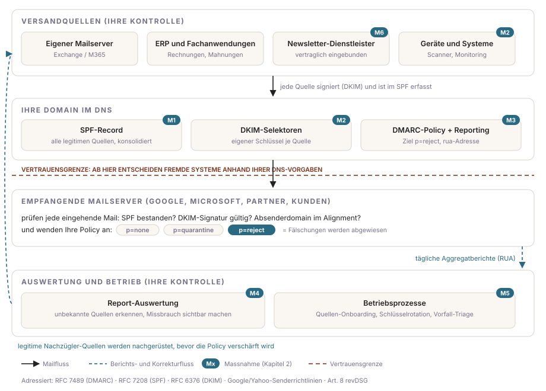

Kriminelle können im Namen Ihrer Domain E-Mails verschicken, solange Ihre Domain das nicht technisch unterbindet. Genau das leistet DMARC im Zusammenspiel mit SPF und DKIM: Es legt fest, wie fremde Mailserver mit Nachrichten umgehen sollen, die vorgeben, von Ihnen zu stammen, und liefert Ihnen Berichte über jeden Missbrauchsversuch. Trotzdem scheitern DMARC-Projekte selten an der Technik, sondern am fehlenden Auftrag: Ohne Budget, Verantwortlichkeiten und Rückendeckung der Geschäftsleitung bleibt die Domain im Dauerzustand "Monitoring", der niemanden schützt.

Dieser Beitrag ist deshalb als Blueprint aufgebaut, ein katalogisiertes Umsetzungs-Pattern nach dem Vorbild von Architektur-Patterns: erst die Zielarchitektur mit den Massnahmen, dann die Frage, ob das Pattern zu Ihrer Situation passt, dann Umsetzung, Betrieb, Recht und Messung, und ganz am Ende die kopierfertige Entscheidungsvorlage für die Geschäftsleitung.

**Schweiz-Fokus:** Die rechtlichen Aussagen in diesem Blueprint beziehen sich auf Schweizer Recht (revDSG und Datenschutzverordnung). Wo die Rechtslage in der EU abweicht, ist der Absatz ausdrücklich als EU-Hinweis gekennzeichnet.

## Steckbrief

| | |
| --- | --- |
| Blueprint | BP-001: DMARC-Einführung |
| Version | 2026.08 (Stand 3. August 2026) |
| Status | Entwurf |
| Autor | Rafael Pfister |
| Zielgruppe | CIO, CTO, IT-Leitung; umsetzbar durch Mailadministration |
| Geltungsbereich | Alle eigenen Maildomains inklusive Neben- und Marketingdomains |
| Standards | RFC 7489 (DMARC), RFC 7208 (SPF), RFC 6376 (DKIM), Senderrichtlinien von Google, Yahoo und Microsoft |
| Rechtsrahmen (Schweiz) | Art. 8, 9, 12, 24 revDSG; Art. 1 bis 6 DSV |

## Der Blueprint im Überblick

Alle Blueprints auf dieser Website folgen derselben Logik, damit Sie sich nur einmal einarbeiten müssen: **Was ist die Lösung** (1. Zielarchitektur, 2. Massnahmenkatalog), **passt sie zu mir** (3. Eignung, 4. Annahmen), **wie führe ich sie ein** (5. Umsetzung, 6. Betrieb, 7. Fallstricke), **wie sichere ich sie ab** (8. Recht und Governance), **wie messe ich sie** (9. Messgrössen) und **wie entscheide ich** (10. Entscheidungsvorlage zum Kopieren). Die Bausteine funktionieren einzeln und als Ganzes.

## Ausgangslage

Drei Entwicklungen haben DMARC vom Nice-to-have zur Grundanforderung gemacht.

Erstens der Betrugsdruck: Beim CEO-Betrug und bei gefälschten Zahlungsaufforderungen ist die täuschend echte Absenderadresse das zentrale Werkzeug. Eine Domain ohne durchgesetzte DMARC-Policy überlässt dieses Werkzeug den Angreifern, inklusive der Mails an Ihre eigenen Mitarbeitenden, Kunden und Lieferanten.

Zweitens die Anforderungen der grossen Empfänger: Google und Yahoo verlangen seit Februar 2024 von Absendern grosser Mailmengen unter anderem SPF, DKIM und eine DMARC-Policy; Microsoft hat für Outlook vergleichbare Anforderungen nachgezogen. Wer die Vorgaben nicht erfüllt, riskiert, dass legitime Rechnungen und Newsletter im Spam landen oder abgewiesen werden. Zustellbarkeit ist damit ein direktes Umsatz- und Prozessthema geworden.

Drittens die Sorgfaltspflicht: Das revDSG verlangt in Art. 8 eine dem Risiko angemessene Datensicherheit. Eine direkte gesetzliche DMARC-Pflicht gibt es in der Schweiz nicht, aber wer Personendaten per E-Mail kommuniziert und die etablierten Authentifizierungsstandards ignoriert, wird sich nach einem Vorfall fragen lassen müssen, ob die getroffenen Massnahmen dem Stand der Technik entsprachen.

**EU-Hinweis:** Unternehmen im Anwendungsbereich der NIS2-Richtlinie müssen grundlegende Verfahren der Cyberhygiene und Kommunikationssicherheit nachweisen; E-Mail-Authentifizierung mit SPF, DKIM und DMARC gehört in der Umsetzungspraxis der Mitgliedstaaten zum erwarteten Grundschutz. Für Schweizer Unternehmen mit EU-Töchtern oder EU-Kunden kann NIS2 damit indirekt zur Anforderung werden.

Den Ist-Zustand Ihrer Domains prüfen Sie vor dem Einstieg mit dem kostenlosen [Mail-DNS-Check](https://rafaelpfister.ch/tools/mail-check): SPF, DKIM, DMARC und weitere Mailstandards in Sekunden direkt im Browser, auch für Neben- und Marketingdomains. Angreifer nehmen die Domain, die am schlechtesten geschützt ist.

## 1. Zielarchitektur

Das Diagramm zeigt den Zielzustand: Jede legitime Versandquelle ist authentifiziert, Ihre Domain publiziert die Spielregeln im DNS, fremde Empfänger setzen sie durch, und die Berichte fliessen zurück in Auswertung und Betrieb. Die Badges M1 bis M6 verorten die sechs Massnahmen aus Kapitel 2.



Die Architektur hat einen entscheidenden Kniff: Die Durchsetzung passiert nicht bei Ihnen, sondern bei den empfangenden Mailservern weltweit, und zwar anhand der Vorgaben, die Sie im DNS publizieren. Unterhalb der Vertrauensgrenze haben Sie keine technische Kontrolle mehr; deshalb müssen die Vorgaben oberhalb stimmen, bevor Sie sie verschärfen. Der Berichtsfluss (rechts im Diagramm) ist Ihr einziges Fenster in das, was fremde Empfänger sehen, und damit die Grundlage jeder Entscheidung im Projekt.

### Gestaltungsprinzipien

1. **Sichtbarkeit vor Durchsetzung.** Keine Policy-Verschärfung ohne vorherige Auswertung der DMARC-Berichte. Wer blind auf reject stellt, verliert legitime Mails; wer nie verschärft, hat keinen Schutz.
2. **Alle Domains im Geltungsbereich.** Haupt-, Neben-, Park- und Marketingdomains werden gleich behandelt. Angreifer wählen die schwächste Domain, nicht die wichtigste.
3. **Jede Versandquelle authentifiziert selbst.** Jedes System bekommt eine eigene DKIM-Signatur statt pauschaler SPF-Freigaben. Das hält Quellen unterscheidbar, kündbar und auditierbar.
4. **Jeder Schritt ist umkehrbar.** Verschärfungen erfolgen pro Domain und mit Prozentsatz-Staffelung (pct), sodass ein Fehlgriff innert Minuten zurückgenommen werden kann.
5. **Betrieb vor Projektende.** Die Durchsetzung wird erst aktiviert, wenn die Betriebsprozesse (Kapitel 6) stehen und Verantwortliche benannt sind.
6. **Dienstleister vertraglich eingebunden.** Versanddienstleister liefern eigene DKIM-Selektoren, kündigen Änderungen an und sind zur Mitwirkung verpflichtet.

## 2. Massnahmenkatalog

Die sechs Massnahmen sind die referenzierbaren Bausteine des Blueprints; Umsetzung (Kapitel 5), Fallstricke (Kapitel 7) und Messgrössen (Kapitel 9) verweisen auf sie.

### Authentifizierung der Quellen (M1, M2)

**M1: SPF konsolidiert.** Ein SPF-Record je Domain, der genau die legitimen Versandsysteme autorisiert: keine Altlasten, keine Sammel-Includes, Lookup-Limite eingehalten. Verortung: DNS. Referenz: RFC 7208.

**M2: DKIM je Versandquelle.** Jede Quelle signiert mit einem eigenen Selektor, auch die Systeme der Dienstleister. Kompromittierte oder abgelöste Quellen lassen sich damit einzeln entziehen, ohne den restlichen Versand zu berühren. Verortung: Versandquellen und DNS. Referenz: RFC 6376.

### Durchsetzung und Sichtbarkeit (M3, M4)

**M3: DMARC-Policy mit Reporting.** Der DMARC-Record verlangt Alignment, definiert die Policy (Zielzustand p=reject) und bestellt die Aggregatberichte an eine kontrollierte Adresse (rua). Verortung: DNS. Referenz: RFC 7489.

**M4: Report-Auswertung.** Die täglichen XML-Berichte werden werkzeuggestützt ausgewertet: legitime Nachzügler erkennen, Missbrauch beziffern, Verschärfungsentscheide begründen. Ohne M4 bleibt M3 blind. Verortung: Auswertung und Betrieb. Referenz: Art. 8 revDSG (Nachweis der Wirksamkeit).

### Organisation (M5, M6)

**M5: Betriebsprozesse.** Quellen-Onboarding vor Go-Live, Schlüsselrotation, Fehlzustellungs-Triage und Vorfallprozess sind als Regelprozesse verankert (Kapitel 6). Verortung: Auswertung und Betrieb.

**M6: Dienstleister-Einbindung.** Versanddienstleister sind vertraglich zu eigenen Selektoren, Ankündigungsfristen und Mitwirkung verpflichtet; die Formulierungen liefert die [Checkliste zum Provider-Wechsel](https://rafaelpfister.ch/blog/massenmailing-provider-wechsel-checkliste). Verortung: Versandquellen. Referenz: Art. 9 revDSG.

## 3. Wann dieser Blueprint passt, wann nicht

Der Blueprint passt, wenn mindestens einer dieser Punkte zutrifft:

- Ihr Unternehmen versendet geschäftskritische Mails (Rechnungen, Offerten, Lohnabrechnungen) unter eigener Domain.
- Newsletter- oder Transaktionsversand läuft über externe Dienstleister, deren Authentifizierung Sie nie geprüft haben.
- Sie sind von den Bulk-Sender-Anforderungen grosser Empfänger betroffen oder beliefern Kundschaft bei Google, Microsoft oder Yahoo.
- Es gab bereits Spoofing- oder Phishing-Vorfälle mit Ihrer Absenderdomain, oder Ihre Branche ist ein typisches Ziel für Zahlungsbetrug.
- Sie besitzen Domains ohne Mailversand: Auch die brauchen Schutz-Records, sonst sind sie das offene Scheunentor.

Der Blueprint passt nicht oder nur angepasst, wenn:

- Ihre Domains von einer Konzern-IT mit bestehender DMARC-Governance verwaltet werden; dann gilt deren Pattern, nicht dieses.
- Sie keine Hoheit über die DNS-Zonen haben; dann ist die Rückgewinnung dieser Hoheit das vorgelagerte Projekt.
- E-Mail vollständig ausgelagert ist und der Provider DMARC nachweislich betreibt; dann reduziert sich der Blueprint auf Kontrolle und Vertragsprüfung (M6).

## 4. Annahmen

Die Umsetzung setzt voraus: Schreibzugriff auf alle DNS-Zonen oder einen kurzen Draht zum DNS-Dienstleister; die Fähigkeit, Versandquellen zu inventarisieren (Fachbereiche antworten, Logs sind zugänglich); ein Budget für ein Report-Auswertungswerkzeug oder eine externe Auswertung; Rückendeckung der Geschäftsleitung für die Durchsetzungsphase, weil dort im Zweifel einzelne Altsysteme angepasst werden müssen. Fehlt eine dieser Voraussetzungen, adressieren Sie sie vor Projektstart; die Entscheidungsvorlage (Kapitel 10) holt die Rückendeckung formal ein.

## 5. Umsetzung

Die Roadmap für die Geschäftsleitung: fünf Phasen, jede mit einem messbaren Exit-Kriterium. Ohne erfülltes Exit-Kriterium startet die nächste Phase nicht; das ist der eingebaute Schutz gegen den verlorenen Rechnungslauf.

| Phase | Inhalt | Typische Dauer | Exit-Kriterium |
| --- | --- | --- | --- |
| 1. Inventar | Alle Domains und alle legitimen Versandquellen erfassen (Mailserver, ERP, Newsletter-Dienst, Ticketing, Gerätemails) | 2 bis 4 Wochen | Vollständige Liste der Versandquellen, Verantwortliche benannt |
| 2. Grundlagen | M1 und M2 umsetzen, M3 mit p=none aktivieren, M4 einrichten | 2 bis 6 Wochen | Alle bekannten Quellen bestehen SPF- und DKIM-Prüfung |
| 3. Monitoring | Berichte auswerten (M4), unbekannte Quellen klären: legitim nachrüsten oder als Missbrauch einstufen | 4 bis 8 Wochen | Über 98 Prozent des legitimen Volumens besteht die DMARC-Prüfung |
| 4. Durchsetzung | Policy schrittweise verschärfen: quarantine mit steigendem Prozentsatz, danach reject (M3) | 4 bis 12 Wochen | p=reject auf allen Domains, keine Verluste legitimer Mails |
| 5. Betrieb | Übergabe in die Regelprozesse (M5), Dokumentation, Regelreporting | dauerhaft | Prozesse aktiv, Verantwortung geregelt, erstes Regelreporting erfolgt |

Die Arbeitspakete zum Kopieren in Ihre Projektablage; jedes zahlt auf eine Massnahme ein. Die Richtaufwände gelten für ein mittleres Unternehmen mit einer Handvoll Domains und externem Newsletter-Versand.

| AP | Arbeitspaket (Massnahme) | Verantwortlich | Richtaufwand |
| --- | --- | --- | --- |
| 1.1 | Domain-Inventar: alle registrierten Domains, DNS-Zugriffe und Zuständigkeiten klären | IT-Betrieb | wenige Stunden |
| 1.2 | Versandquellen-Inventar: Befragung der Fachbereiche, Auswertung der Mailserver-Logs | Projektleitung mit Fachbereichen | 1 bis 2 Tage, verteilt |
| 1.3 | Dienstleister-Kontakte und Vertragslage erfassen (M6) | Projektleitung | wenige Stunden |
| 2.1 | SPF pro Domain konsolidieren (M1) | Mailadministration | wenige Stunden pro Domain |
| 2.2 | DKIM je Versandquelle einrichten, auch bei Dienstleistern (M2, M6) | Mailadministration mit Dienstleistern | Stunden bis Tage je Quelle |
| 2.3 | DMARC-Records mit p=none und rua auf allen Domains setzen (M3) | Mailadministration | wenige Stunden |
| 2.4 | Report-Auswertung einrichten (M4) | Projektleitung | 0.5 bis 1 Tag |
| 3.1 | Wöchentliche Report-Analyse: unbekannte Quellen identifizieren und klassifizieren (M4) | Mailadministration | 1 bis 2 Stunden pro Woche |
| 3.2 | Legitime Nachzügler-Quellen nachrüsten (zurück zu AP 2.2) | Mailadministration | nach Befund |
| 4.1 | Policy-Verschärfung pro Domain: quarantine mit pct-Staffelung, dann reject (M3) | Mailadministration | wenige Stunden, über Wochen verteilt |
| 4.2 | Abnahme: Exit-Kriterien prüfen, Restrisiken dokumentieren, Projektabschluss | Projektleitung mit Auftraggeber | 0.5 Tage |
| 5.1 | Übergabe in den Betrieb: Prozesse aktivieren (M5), Dokumentation, Schulung Stellvertretung | Projektleitung an IT-Betrieb | 0.5 bis 1 Tag |

## 6. Betrieb

DMARC ist nach dem Projekt nicht fertig, sondern in Betrieb (M5). Diese Regelprozesse gehören in Ihr Betriebshandbuch; ohne sie erodiert der Schutz mit der ersten neuen Fachanwendung.

| Prozess | Auslöser | Rhythmus | Verantwortlich |
| --- | --- | --- | --- |
| Report-Review: DMARC-Berichte sichten, Auffälligkeiten klären | laufend | wöchentlich, nach Stabilisierung monatlich | Mailadministration |
| Quellen-Onboarding: neue Versandsysteme vor Go-Live authentifizieren (SPF/DKIM, Freigabe) | neues System oder neuer Dienstleister | bei Bedarf, als Pflichtschritt im Beschaffungsprozess | Mailadministration |
| DKIM-Schlüsselrotation | Kalender oder Sicherheitsvorfall | jährlich geprüft | Mailadministration |
| Fehlzustellungs-Triage: gemeldete verlorene Mails gegen Reports prüfen | Meldung aus Fachbereich | ad hoc, definierter Meldeweg | Servicedesk mit Mailadministration |
| Spoofing-Vorfall: Missbrauchswelle erkennen, Meldekette auslösen (inkl. Prüfung der Meldepflicht nach Art. 24 revDSG) | Auffälligkeit in Reports oder Meldung | ad hoc | Mailadministration mit Sicherheitsverantwortlichem |
| Management-Reporting: KPI-Set (Kapitel 9) an das definierte Gremium | Quartalsende | quartalsweise | IT-Leitung |

## 7. Typische Fallstricke

| Risiko | Wirkung | Gegenmassnahme im Blueprint |
| --- | --- | --- |
| Legitime Mails gehen bei der Verschärfung verloren | Rechnungen, Offerten oder Systemmails erreichen Empfänger nicht | Prinzip 1 und 4: Verschärfung erst nach 98-Prozent-Kriterium, pct-Staffelung, sofortige Umkehrbarkeit |
| Vergessene Versandquellen tauchen spät auf | Verzögerung der Durchsetzung, Frust in Fachbereichen | AP 1.2 mit Fachbereichsbefragung, Monitoring-Phase als Sicherheitsnetz, Quellen-Onboarding (M5) für die Zukunft |
| Dienstleister unterstützt keine eigenen DKIM-Selektoren | Quelle bleibt schwach authentifiziert | M6: vertragliche Anforderung, notfalls Anbieterwechsel über die Provider-Checkliste |
| Report-Flut wird nicht ausgewertet | Schutz stagniert bei p=none, Missbrauch bleibt unsichtbar | M4 als eigenes Arbeitspaket budgetieren, Report-Review als fester Betriebsprozess |
| Wissensmonopol bei einer Person | Betrieb bricht bei Abwesenheit oder Austritt | AP 5.1 Übergabe mit Dokumentation und Stellvertretung |

## 8. Recht und Governance (Schweiz)

Die Checkliste für die Governance-Seite des Vorhabens, mit den massgeblichen Schweizer Rechtsgrundlagen. Sie ist bewusst als Abhakliste formuliert; die Verweise führen auf die Gesetzestexte in den Quellen.

- [ ] **Datensicherheit dokumentiert:** DMARC, SPF und DKIM sind als technische Massnahme im Datensicherheitskonzept erfasst (Art. 8 revDSG; die Anforderungen an die Massnahmen konkretisiert die Datenschutzverordnung, Art. 1 bis 6 DSV).
- [ ] **Verzeichnis nachgeführt:** Die Bearbeitung von Maildaten und Report-Daten ist im Verzeichnis der Bearbeitungstätigkeiten abgebildet (Art. 12 revDSG).
- [ ] **Dienstleister geregelt:** Versanddienstleister und Report-Auswertungsdienste bearbeiten Daten im Auftrag; Vertrag nach Art. 9 revDSG inklusive technischer und organisatorischer Massnahmen liegt vor (M6).
- [ ] **Report-Daten eingeordnet:** DMARC-Aggregatberichte enthalten IP-Adressen und Versandmetadaten; Umgang, Aufbewahrungsdauer und Zugriff sind definiert (IP-Adressen können Personendaten sein).
- [ ] **Meldeprozess verankert:** Der Spoofing-Vorfallprozess (Kapitel 6) prüft die Meldepflicht an den EDÖB bei Verletzungen der Datensicherheit mit hohem Risiko (Art. 24 revDSG).
- [ ] **Entscheide dokumentiert:** GL-Freigabe, Phasen-Abnahmen und bewusste Abweichungen von den Gestaltungsprinzipien sind schriftlich festgehalten (Nachweis der Sorgfalt).

**EU-Hinweis:** Gilt für Ihr Unternehmen zusätzlich die DSGVO, treten Art. 32 (Sicherheit der Verarbeitung) und Art. 28 (Auftragsverarbeitung) neben die genannten revDSG-Artikel, und für die Vorfallmeldung gilt die 72-Stunden-Frist nach Art. 33 DSGVO. Im Anwendungsbereich der NIS2-Richtlinie ist die E-Mail-Authentifizierung Teil der geforderten Cyberhygiene (Art. 21).

## 9. Messgrössen

Wenige Kennzahlen, dafür konsequent erhoben und quartalsweise an das definierte Gremium berichtet. Dieselben Werte gehören in die Entscheidungsvorlage (Kapitel 10) und später in das Regelreporting; so bleibt das Versprechen an die Geschäftsleitung messbar.

| KPI | Zielwert | Quelle |
| --- | --- | --- |
| Anteil des legitimen Mailvolumens mit bestandener DMARC-Prüfung | über 98 Prozent | DMARC-Aggregatberichte (M4) |
| Policy-Stufe je Domain | reject auf allen Domains | DNS-Records (M3) |
| Erkannte Missbrauchsversuche pro Monat | Trend beobachten, Ausschläge triagieren | DMARC-Aggregatberichte (M4) |
| Nicht authentifizierte neue Quellen im Quartal | 0 (alle über Quellen-Onboarding) | Report-Review (M5) |
| Zeit von Quellen-Meldung bis Authentifizierung | unter 2 Wochen | Ticketing |

## 10. Entscheidungsvorlage

Zum Schluss das Mitnahme-Werkzeug: der Antrag an die Geschäftsleitung auf einer halben Seite, in ihrer Sprache: Risiko, Nutzen, Kosten, Entscheid. Ersetzen Sie die Platzhalter mit den Resultaten aus Ihrem Domain-Check und den eingeholten Offerten.

```text
Antrag an die Geschäftsleitung: Schutz unserer Maildomains (DMARC)

Ausgangslage
Unsere Domain [domain.ch] kann heute von Dritten als Absender missbraucht
werden. [Resultat des Domain-Checks einsetzen, z. B.: SPF vorhanden, DKIM
unvollständig, keine durchgesetzte DMARC-Policy.] Gefälschte Mails in
unserem Namen richten sich gegen unsere Mitarbeitenden (Zahlungsbetrug),
unsere Kunden (Phishing) und unsere Marke.

Risiko bei Verzicht
1. Zahlungs- und CEO-Betrug mit unserer Absenderadresse bleibt möglich.
2. Grosse Empfänger (Google, Yahoo, Microsoft) stellen legitime Mails
   von unzureichend authentifizierten Domains zunehmend in den Spam oder
   weisen sie ab; betroffen sind auch Rechnungen und Offerten.
3. Nach einem Vorfall ist die Frage nach der Angemessenheit unserer
   Datensicherheit (Art. 8 revDSG) unangenehm zu beantworten.

Antrag
Umsetzung von Blueprint BP-001: Durchsetzung von DMARC (Stufe reject)
auf allen [X] Domains innert [X] Monaten, in fünf Phasen mit definierten
Exit-Kriterien. Keine Abschaltrisiken: Die Verschärfung erfolgt
schrittweise und messbar.

Kosten
Einmalig: [CHF X] (Umsetzung, Dienstleisteranpassungen, Begleitung)
Wiederkehrend: [CHF X pro Jahr] (Report-Auswertung, Betrieb)

Nutzen
Missbrauch unserer Domain wird technisch unterbunden und sichtbar
gemacht; die Zustellbarkeit unserer legitimen Mails ist gesichert;
wir erfüllen die Anforderungen grosser Empfänger und dokumentieren
unsere Sorgfalt.

Messgrössen
Anteil des legitimen Mailvolumens mit bestandener DMARC-Prüfung
(Ziel: über 98 %), Policy-Stufe pro Domain (Ziel: reject),
erkannte Missbrauchsversuche pro Monat (Reporting an [Gremium]).

Entscheid
[ ] Freigabe Budget und Projektstart per [Datum]
Verantwortlich: [Name], Begleitung: [intern/extern]
```

## Verwandte Blueprints und Werkzeuge

Der [Mail-DNS-Check](https://rafaelpfister.ch/tools/mail-check) liefert den Ist-Zustand für Steckbrief und Entscheidungsvorlage. Läuft Ihr Versand über einen Dienstleister, gehören dessen Zusagen vertraglich fixiert: [Provider-Wechsel beim Massenmailing: Fragenkatalog und Mailvorlage](https://rafaelpfister.ch/blog/massenmailing-provider-wechsel-checkliste). Steht ohnehin eine Neubeschaffung an, hilft der [Kriterienkatalog zur Gateway-Evaluation](https://rafaelpfister.ch/blog/e-mail-security-gateway-evaluieren). Alle Blueprints, Vorlagen und Werkzeuge für Entscheider sammelt der [CIO-Hub](https://rafaelpfister.ch/cio).

## Glossar für Entscheider

| Begriff | Bedeutung in einem Satz |
| --- | --- |
| SPF | DNS-Eintrag, der festlegt, welche Server im Namen Ihrer Domain senden dürfen. |
| DKIM | Kryptografische Signatur, mit der eine Versandquelle jede Mail als echt kennzeichnet. |
| DMARC | Regelwerk, das Empfängern sagt, was mit Mails geschehen soll, die SPF- und DKIM-Prüfung nicht bestehen, inklusive Berichtsfunktion. |
| Policy (p=none/quarantine/reject) | Die drei Durchsetzungsstufen: nur beobachten, in den Spam stellen, abweisen. |
| pct | Prozentsatz der Mails, auf den die Policy angewendet wird; ermöglicht die schrittweise Verschärfung. |
| Alignment | Prüfung, ob die sichtbare Absenderdomain zur technisch geprüften Domain passt; erst das macht die Absenderzeile fälschungssicher. |
| Aggregatbericht (RUA) | Täglicher XML-Bericht grosser Empfänger darüber, wer alles im Namen Ihrer Domain gesendet hat. |
| Versandquelle | Jedes System, das Mails mit Ihrer Absenderdomain verschickt: Mailserver, ERP, Newsletter-Dienst, Ticketing, Multifunktionsgeräte. |

## Einordnung

DMARC ist kein Allheilmittel: Es schützt Ihre Domain vor Fälschung, nicht Ihre Mitarbeitenden vor Phishing von ähnlich klingenden Fremddomains, und es ersetzt weder Schulung noch technische Mailhygiene. Es ist aber die eine Massnahme in der E-Mail-Sicherheit, die gleichzeitig Betrug erschwert, die Zustellbarkeit sichert und pro Monat messbar ausweist, was sie verhindert. Mit diesem Blueprint lässt sie sich der Geschäftsleitung sauber beantragen und ohne Abschaltrisiko umsetzen.

## Quellen

1.  [RFC 7489: Domain-based Message Authentication, Reporting, and Conformance (DMARC)](https://datatracker.ietf.org/doc/html/rfc7489): Technische Spezifikation von Policy-Stufen, Alignment und Reporting (M3)

2.  [RFC 7208: Sender Policy Framework (SPF)](https://datatracker.ietf.org/doc/html/rfc7208): Autorisierung der Versandsysteme im DNS, inklusive der Lookup-Limite aus M1

3.  [RFC 6376: DomainKeys Identified Mail (DKIM) Signatures](https://datatracker.ietf.org/doc/html/rfc6376): Signaturverfahren und Selektoren, Grundlage von M2

4.  [Google: Email sender guidelines](https://support.google.com/a/answer/81126): Anforderungen an Absender grosser Mailmengen, darunter SPF, DKIM und DMARC, in Kraft seit Februar 2024

5.  [Bundesgesetz über den Datenschutz (DSG) vom 25. September 2020](https://www.fedlex.admin.ch/eli/cc/2022/491/de): Massgeblich für Kapitel 8 sind Art. 8 (Datensicherheit), Art. 9 (Auftragsbearbeitung), Art. 12 (Verzeichnis) und Art. 24 (Meldepflicht)

6.  [Verordnung über den Datenschutz (DSV) vom 31. August 2022](https://www.fedlex.admin.ch/eli/cc/2022/568/de): Konkretisiert in Art. 1 bis 6 die Anforderungen an die technischen und organisatorischen Massnahmen nach Art. 8 revDSG

7.  [Richtlinie (EU) 2022/2555 (NIS2)](https://eur-lex.europa.eu/eli/dir/2022/2555/oj): Grundlage des gekennzeichneten EU-Hinweises; Art. 21 verlangt von betroffenen Unternehmen grundlegende Verfahren der Cyberhygiene
