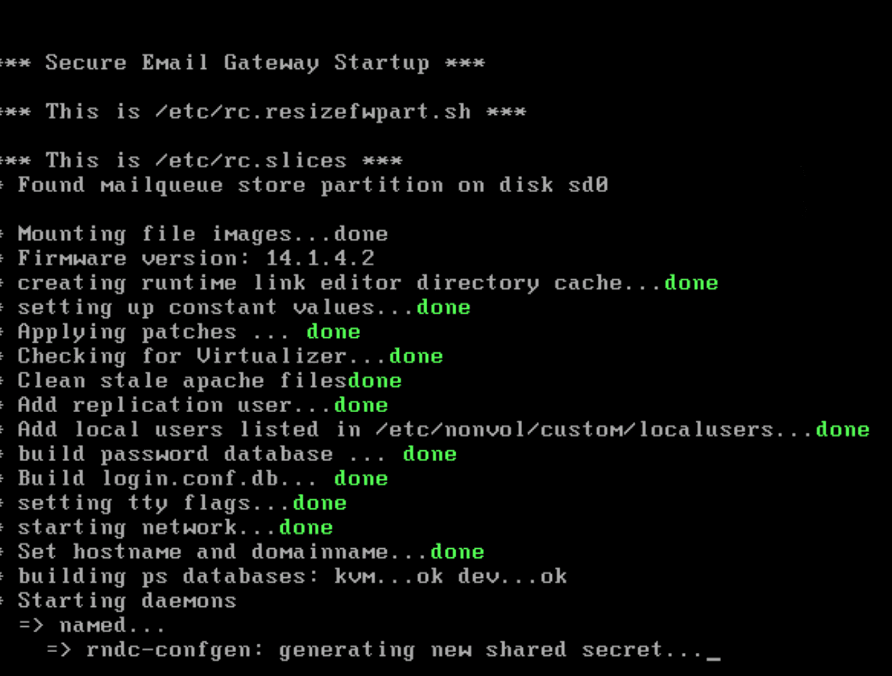

# Login nach Update von HIN Mailgateway Version 14.1.4.2 auf 15.0.5 nicht mehr möglich (betrifft nur Systeme im Clusterverbund)

## Fehlerbild

Nach dem Update auf Version 15.0.5 ist das Login auf die Appliance für einige Minuten noch möglich. Nach ca. 10 Minuten schlagen Login-Versuche auf beiden Cluster-Members fehl. Das Fehlerbild deutet darauf hin, dass die Cluster-Replikation die Probleme verursacht. Gemäss Hersteller ist das Problem bekannt und sollte in der nächsten Version gelöst werden.

## Lösung

1. Snapshots von beiden Cluster-Members gleichzeitig wiederherstellen
2. Ein Cluster-Member muss nach dem Restore ausgeschaltet bleiben
3. Cluster auflösen (vorher noch den Cluster Identifier herunterladen)
4. System bootet direkt und ohne Vorwarnung!

5. System 1 updaten
6. System 1 herunterfahren
7. Selbes Spiel mit System 2 wiederholen

## Quellen

1. [SEPPmail-Dokumentation – «Cluster / Hochverfügbarkeit»](https://docs.seppmail.com/ch/04_com_09_cl_01_general.html) — Cluster-Typen und Replikation der Konfiguration über alle Knoten.
2. [SEPPmail-Dokumentation – «Administration»](https://docs.seppmail.com/de/07_mi_11_adm__administration.html) — Update-Reihenfolge im Cluster (Frontend vor Backend) und die Anforderung identischer Versionsstände.
3. [HIN Mailgateway: Backup & Disaster Recovery im Cluster](/blog/hin-mailgateway-backup-disaster-recovery) — vertiefende Betrachtung von Cluster-Replikation, Backup und Restore.
