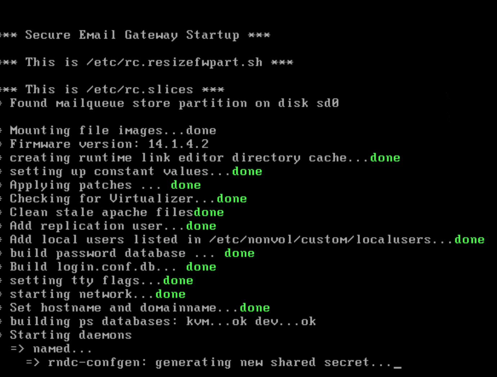

# HIN Mailgateway 15.0.5: Login-Ausfall nach dem Cluster-Update beheben

Beim Update eines HIN Mailgateway von 14.1.4.2 auf 15.0.5 kann ein Fehler in der Cluster-Replikation die Anmeldung auf beiden Appliances lahmlegen. Einzelne Systeme sind nicht betroffen. Der Hersteller kennt das Problem und plant eine Korrektur für eine folgende Version.

**Update vom 29. Juli 2026:** Die angekündigte Korrektur ist da. Das Patch-Release 15.0.6 unterdrückt das Passwort-Rehashing, wenn Cluster-Mitglieder unterschiedliche Firmware-Versionen fahren — exakt die Konstellation, die den hier beschriebenen Ausfall ausgelöst hatte. Die Einordnung steht im Artikel zu [SEPPmail 15.0.6 und 15.0.6.1](/blog/seppmail-releases-15-0-6-und-15-0-6-1); die folgende Wiederherstellungsprozedur bleibt für Cluster relevant, die noch auf 15.0.5 aktualisieren.

## Fehlerbild

Unmittelbar nach dem Update lässt sich die Weboberfläche noch öffnen. Rund zehn Minuten später scheitert die Anmeldung auf beiden Cluster-Knoten. Dass der Fehler zeitversetzt und auf beiden Systemen auftritt, weist auf die replizierte Cluster-Konfiguration als Ursache hin.

## Wiederherstellung

Die folgenden Schritte verändern die Cluster-Konfiguration. Vorher müssen aktuelle Sicherungen und der Cluster-Identifier verfügbar sein.

1. Die zeitgleich erstellten Snapshots beider Cluster-Knoten wiederherstellen.
2. Nach dem Restore einen Knoten ausgeschaltet lassen.
3. Auf dem laufenden Knoten zuerst den Cluster-Identifier herunterladen und danach den Cluster auflösen.
4. Achtung: Nach dem Auflösen startet die Appliance sofort und ohne weitere Rückfrage neu.

5. Den ersten Knoten auf Version 15.0.5 aktualisieren und anschliessend herunterfahren.
6. Den zweiten Knoten starten und dieselben Schritte dort wiederholen.
7. Erst wenn beide Systeme einzeln funktionieren und denselben Versionsstand haben, den Cluster gemäss Herstellerdokumentation wieder aufbauen.

Dieses Verfahren verhindert, dass eine fehlerhafte Konfiguration während des Updates erneut zwischen den Knoten repliziert wird.

## Quellen

1. [SEPPmail-Dokumentation – «Cluster / Hochverfügbarkeit»](https://docs.seppmail.com/ch/04_com_09_cl_01_general.html): Cluster-Typen und Replikation der Konfiguration über alle Knoten.
2. [SEPPmail-Dokumentation – «Administration»](https://docs.seppmail.com/de/07_mi_11_adm__administration.html): Update-Reihenfolge im Cluster (Frontend vor Backend) und die Anforderung identischer Versionsstände.
3. [HIN Mailgateway: Backup & Disaster Recovery im Cluster](/blog/hin-mailgateway-backup-disaster-recovery): vertiefende Betrachtung von Cluster-Replikation, Backup und Restore.
