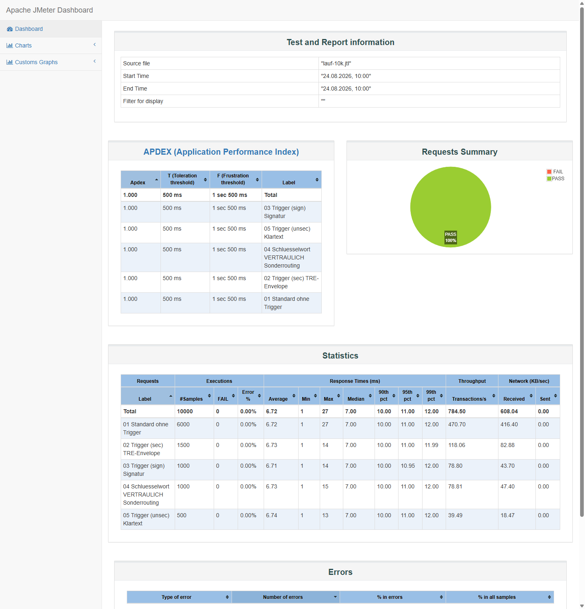
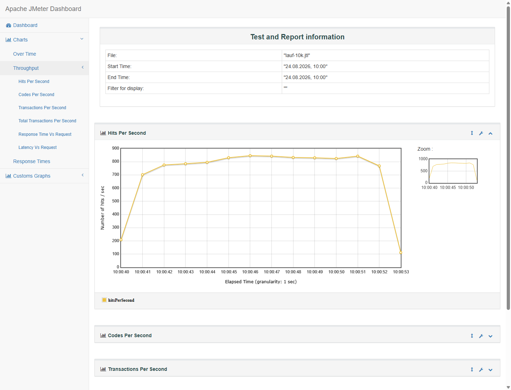

# SMTP-Lasttest mit Apache JMeter in der Praxis: 10'000 Mails, fünf Regelpfade, ein HTML-Report

Der [Überblicksartikel zu Mail-Lasttests](/blog/mail-lasttest-tools-linux-windows-vergleich) hat die Werkzeuge verglichen und den Testplan skizziert. Hier folgt die praktische Durchführung: ein vollständiger JMeter-Lasttest mit 10'000 Mails, einem Nachrichtenmix entlang realer Gateway-Regelpfade und dem HTML-Report als Auswertung. Alle gezeigten Werte stammen aus dem tatsächlichen Lauf, inklusive der Fehler, die unterwegs auftraten.

Das Szenario ist einem realen Projekt nachempfunden: Ein E-Mail-Verschlüsselungs-Gateway auf Apache-James-Basis (Totemomail) hängt als Smarthost-Schlaufe hinter Exchange Online und entscheidet pro Nachricht über Verschlüsselung, Signierung und Sonderrouting. Das Mailet-Ruleset kennt dafür mehrere Pfade: Betreff-Trigger wie (sec), (sign) und (unsec), Schlüsselwörter wie VERTRAULICH für das Routing zu einem Branchen-Gateway und den Standardpfad mit Zertifikatsprüfung und Klartext-Fallback. Ein Lasttest, der nur eine einzige Nachrichtensorte einliefert, würde immer denselben Pfad durch dieses Regelwerk messen; der Testplan bildet deshalb fünf Klassen ab, deren Mischverhältnis dem erwarteten Verkehr entspricht.

## Der Aufbau: nichts installieren müssen

Der Test lief auf einer Windows-Maschine ohne Java und ohne JMeter. Beides lässt sich portabel betreiben, was auf Admin-Arbeitsplätzen mit eingeschränkten Installationsrechten der entscheidende Punkt ist: Temurin-JRE als ZIP von Adoptium, JMeter als ZIP von apache.org, beides entpacken, `JAVA_HOME` auf das JRE-Verzeichnis setzen, fertig.

```bash
export JAVA_HOME="$PWD/jdk-21-jre"
export PATH="$JAVA_HOME/bin:$PATH"
./apache-jmeter-5.6.3/bin/jmeter -n -t gateway-lasttest.jmx -l lauf.jtl -e -o report
```

Als Senke diente eine lokale SMTP-Blackbox auf Basis von aiosmtpd, gut 40 Zeilen Python: Sie nimmt jede Nachricht mit `250` an, verwirft den Inhalt, zählt mit und ordnet jede Mail anhand der Betreffzeile einer Klasse zu. Diese unabhängige Zählung auf der Empfangsseite ist der Kontrollversuch des Tests; stimmen Generator- und Senkenzahlen nicht überein, ist unterwegs etwas verloren gegangen.

```python
from aiosmtpd.controller import Controller

class SinkHandler:
    def __init__(self):
        self.count = 0

    async def handle_DATA(self, server, session, envelope):
        self.count += 1
        # Betreff fuer die Klassen-Statistik aus dem Header ziehen,
        # Inhalt wird verworfen
        return "250 Message accepted for delivery"

controller = Controller(SinkHandler(), hostname="127.0.0.1", port=2525)
controller.start()
```

Wichtig für die Einordnung: Generator und Senke liefen auf derselben Maschine, ohne TLS und ohne Netzwerk dazwischen. Die gemessenen Zahlen sind darum keine Aussage über ein Gateway, sondern der Selbsttest des Generators aus dem Überblicksartikel: der Beleg, dass der Lastaufbau die Zielrate überhaupt erzeugen kann, und die Obergrenze, mit der spätere Messungen gegen das echte Testsystem verglichen werden.

## Der Testplan: fünf Nachrichtenklassen, ein Mischverhältnis

Das Herzstück des Plans ist eine Thread Group mit 20 Threads, 10 Sekunden Ramp-up und 500 Schleifen, also 10'000 Iterationen. Darunter liegen fünf Throughput Controller im Modus "Percent Executions", jeder mit genau einem SMTP Sampler:

| Klasse (Sampler-Label) | Anteil | Regelpfad im Gateway |
|---|---|---|
| 01 Standard ohne Trigger | 60 % | AutoGenerated-Prüfung, Zertifikatsprüfung, Klartext-Fallback |
| 02 Trigger (sec) | 15 % | TRE-Envelope für Empfänger ohne Zertifikat |
| 03 Trigger (sign) | 10 % | Certificate Exchange: signieren, Schlüssel mitschicken |
| 04 Schlüsselwort VERTRAULICH | 10 % | Sonderrouting zum Branchen-Gateway |
| 05 Trigger (unsec) | 5 % | Klartext erzwungen |

Die Aufteilung auf fünf getrennte Sampler statt eines Samplers mit variablem Betreff hat einen handfesten Grund: Der HTML-Report gruppiert alle Kennzahlen nach dem Sampler-Label. Fünf Labels ergeben fünf Zeilen in der Statistik mit eigenen Perzentilen pro Klasse; ein einzelner Sampler mit CSV-gespeistem Betreff ergäbe eine einzige Sammelzeile, und der Unterschied zwischen den Regelpfaden wäre in der Auswertung unsichtbar.

Jeder Sampler füllt die üblichen Felder: Zielhost und Port als benutzerdefinierte Variablen (`${zielhost}`, `${zielport}`), damit derselbe Plan ohne Änderung gegen Senke, Testumgebung oder PreProd laufen kann, dazu Absender, Empfänger, Betreff mit einem klaren Marker (hier das Wort LOADTEST im Betreff) und ein Textkörper von rund 1 bis 2 KB. Die Option "Include timestamp in subject" ergänzt den Einlieferungszeitpunkt in Millisekunden; bei einem späteren Lauf gegen ein echtes mehrstufiges System lässt sich daraus zusammen mit den Empfangszeitpunkten der Senke die Ende-zu-Ende-Latenz pro Nachricht rechnen.

Ein Stolperstein aus diesem Lauf, der sich verallgemeinern lässt: Der erste Versuch scheiterte mit 10'000 Fehlern in 10 Sekunden, alle mit `java.lang.ClassCastException ... NullProperty cannot be cast to ... CollectionProperty` statt einer SMTP-Antwort. Ursache war eine von Hand gebaute JMX-Datei, in der die Header-Liste des Samplers fehlte; der Sampler erwartet die Property zwingend, auch wenn sie leer ist. Die Lehre daraus ist weniger die konkrete Property als das Muster: Testpläne in der GUI zusammenklicken und speichern, nicht als XML von Hand schreiben, und vor jedem Burst einen Kleinstlauf machen und auf der Senke nachsehen, dass Betreff und Inhalt wirklich ankommen. Ein Fehlerzähler von 100 Prozent bei 0 ms Antwortzeit bedeutet fast immer, dass der Fehler vor dem Netzwerk passiert, der Test also nie beim Zielsystem war.

## Der Lauf

Die Messung selbst läuft im CLI-Modus; die GUI ist nur der Editor. Ein einziger Aufruf erzeugt Lauf, Rohdaten und Report:

```bash
jmeter -n -t gateway-lasttest.jmx -l lauf-10k.jtl -e -o report-10k
```

Der Summariser auf der Konsole zeigt den Verlauf live, das Endergebnis des Laufs:

```text
summary =  10000 in 00:00:13 =  781.8/s Avg: 6 Min: 1 Max: 27 Err: 0 (0.00%)
```

10'000 Nachrichten in 12.8 Sekunden, 782 Nachrichten pro Sekunde im Schnitt, keine Fehler. Die Senke bestätigte unabhängig davon exakt 10'000 angenommene Mails mit dem Mix 6000 / 1500 / 1000 / 1000 / 500, das Mischverhältnis der Throughput Controller ging also auf die Nachricht genau auf.

## Der HTML-Report

Das Argument für JMeter gegenüber schlankeren Generatoren wie smtp-source ist die Auswertung, und die liefert der Dashboard-Report ohne Zusatzarbeit:



Die Statistiktabelle ist der wichtigste Teil des Reports. Pro Sampler-Label, also pro Nachrichtenklasse, stehen dort Anzahl, Fehlerquote, Durchschnitt, Median, 90.-, 95.- und 99.-Perzentil, Maximum und Durchsatz. Im konkreten Lauf: Median 7 ms, p95 bei 11 ms, p99 bei 12 ms, Maximum 27 ms, und zwar praktisch identisch über alle fünf Klassen. Das ist bei einer lokalen Senke, die jede Nachricht gleich behandelt, genau das erwartete Bild und gleichzeitig der Referenzwert: Läuft derselbe Plan später gegen das echte Gateway und die (sec)-Klasse zeigt plötzlich ein Vielfaches des Standard-Medians, ist das die Mehrarbeit des Verschlüsselungspfads, sauber isoliert pro Regelzweig.

Der APDEX-Block darüber verdichtet dasselbe auf eine Zahl pro Klasse (hier überall 1.000, weil alle Antworten weit unter der Toleranzschwelle von 500 ms lagen); die Schwellen lassen sich in den Report-Properties an eigene Service-Ziele anpassen. Der Errors-Block bleibt in diesem Lauf leer, ist aber bei Tests gegen echte Systeme die erste Anlaufstelle: Er gruppiert Fehler nach Antworttext, sodass ein `421`-Drosseln des Zielsystems sofort von Verbindungsabbrüchen unterscheidbar ist.

Ein Stolperstein auch hier, und er betrifft jeden kurzen Burst: Die Zeitreihen-Charts des Reports arbeiten standardmässig mit einer Granularität von einer Minute. Ein Lauf von 13 Sekunden kollabiert damit zu einem einzigen Datenpunkt, und die Kurven unter "Charts" sehen aus wie ein Messfehler. Der Report lässt sich aus der vorhandenen JTL-Datei ohne neuen Lauf mit feinerer Auflösung regenerieren:

```bash
jmeter -g lauf-10k.jtl -o report-fein -Jjmeter.reportgenerator.overall_granularity=1000
```

Mit Sekunden-Granularität wird aus dem einzelnen Punkt der tatsächliche Lastverlauf:



Die Kurve zeigt den 10-Sekunden-Ramp-up, ein Plateau um 840 Nachrichten pro Sekunde und den Abfall am Ende, wenn die ersten Threads ihre 500 Schleifen abgeschlossen haben. Für die Interpretation zählt das Plateau, nicht der Durchschnitt über den Gesamtlauf: Der Schnitt von 782/s enthält Ramp-up und Auslauf und unterschätzt die erreichte Dauerrate.

## Was dieser Lauf belegt und was nicht

Belegt ist nach diesem Lauf: Der Testplan ist funktional korrekt (Kleinstlauf mit Inhaltskontrolle auf der Senke), das Mischverhältnis stimmt exakt, und der Generator schafft auf dieser Maschine mindestens 840 Nachrichten pro Sekunde ohne TLS. Wer damit ein Gateway testen will, das für 100 Mails pro Sekunde ausgelegt ist, hat Reserve um den Faktor acht und kann Engpässe guten Gewissens dem Zielsystem zuschreiben.

Nicht belegt ist alles andere, und diese Abgrenzung gehört zu jedem Testbericht: keine Aussage über TLS-Handshake-Kosten (der echte Pfad spricht STARTTLS), keine über das Queue-Verhalten des Gateways, keine über die Verarbeitungszeit der Regelpfade. Dafür zeigt derselbe Plan mit umgestellten Variablen `zielhost`/`zielport` auf die Testumgebung des Gateways; die Auswertung läuft dann identisch, ergänzt um die Gateway-Logs und die Queue-Beobachtung aus dem Überblicksartikel. Genau diese Wiederverwendbarkeit, ein Plan für Senke, Testumgebung und PreProd bei identischer Auswertung, ist der eigentliche Grund, den Aufwand für einen sauberen JMeter-Plan einmal zu treiben.

## Quellen

1.  [Apache JMeter User's Manual: Component Reference, SMTP Sampler](https://jmeter.apache.org/usermanual/component_reference.html): Referenz der Sampler-Felder inklusive Header, Timestamp-Option und EML-Versand.

2.  [Apache JMeter: Generating Dashboard Report](https://jmeter.apache.org/usermanual/generating-dashboard.html): Erzeugung des HTML-Reports aus dem Lauf oder nachträglich aus der JTL, inklusive der Granularitäts- und APDEX-Properties.

3.  [Apache JMeter: Test Plan, Logic Controllers](https://jmeter.apache.org/usermanual/component_reference.html#Throughput_Controller): Funktionsweise des Throughput Controllers im Modus Percent Executions für den Nachrichtenmix.

4.  [aiosmtpd, Dokumentation](https://aiosmtpd.aio-libs.org/): Der asyncio-basierte SMTP-Server, mit dem die Senke in wenigen Zeilen Python entsteht.

5.  [Eclipse Temurin, Adoptium](https://adoptium.net/temurin/releases/): Portable JRE-Archive für den Betrieb von JMeter ohne Java-Installation.
