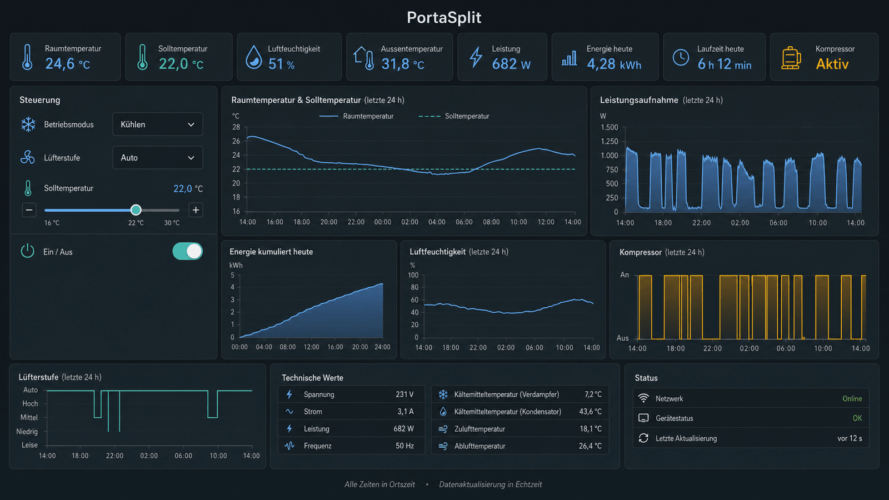

<aside class="article-update">
  <p class="article-update__label">Das Projekt Midea AC LAN warnt: Midea schaltet die Cloud-Schnittstellen ab</p>
  <p>Über diese Schnittstellen bezieht Home Assistant bei der Einrichtung den gerätespezifischen Token und Key. Der Hinweis steht seit dem 19. Mai 2025 im Projekt-Repository. Für PortaSplit-Besitzer heisst das:</p>
  <ol>
    <li><strong>Jetzt einrichten.</strong> Nur die erstmalige Token-Beschaffung braucht die Midea-Cloud. Wer wartet, kann das Gerät möglicherweise nicht mehr in Home Assistant aufnehmen.</li>
    <li><strong>Token, Key und die Konfiguration verschlüsselt sichern.</strong> Nach der Abschaltung sind diese Werte voraussichtlich nicht erneut beschaffbar; das Backup ist dann der einzige Weg zu einer Neueinrichtung.</li>
    <li><strong>Kopplung nicht ohne Not auflösen.</strong> Werkseinstellungen, das Entfernen aus dem Midea-Konto oder ein WLAN-Modul-Tausch erzwingen eine neue Token-Beschaffung, die künftig scheitern kann.</li>
  </ol>
  <p>Bereits eingerichtete Geräte steuern Home Assistant lokal weiter; betroffen ist nach heutigem Stand das Hinzufügen, nicht der Betrieb. Die Hintergründe stehen in diesem Artikel, die konkreten Einrichtungs- und Backup-Schritte im <a href="/blog/midea-portasplit-home-assistant-einrichten">zweiten Teil zu Einbindung und Absicherung</a>.</p>
</aside>



Die Midea PortaSplit gehört zu den interessantesten mobilen Klimageräten für Mietwohnungen: Sie ist als Split-Gerät aufgebaut, ein flaches Aussenteil hängt vor dem Fenster, das eigentliche Gerät steht im Raum, und für die Montage braucht es keinen dauerhaften Eingriff in die Bausubstanz. Weniger bekannt ist, dass sich die PortaSplit auch in Home Assistant einbinden lässt und sich damit abhängig von Raumtemperatur, Strompreis, Fensterstatus oder Anwesenheit steuern lässt.

Die Steuerung läuft nach der Einrichtung weitgehend lokal im eigenen Netzwerk. Ganz ohne Cloud kommt sie jedoch nicht aus, und genau dieser Punkt ist gerade in Bewegung: Das Projekt Midea AC LAN warnt, dass Midea die Cloud-Schnittstellen abschaltet, über die Home Assistant die für die lokale Kommunikation benötigten Zugangsdaten bezieht. Dieser erste Teil erklärt, wie diese Zugangsdaten technisch funktionieren, warum Home Assistant sie überhaupt bekommen konnte und was die Abschaltung praktisch bedeutet. Die Schritt-für-Schritt-Einrichtung und die Netzwerk-Absicherung stehen im [zweiten Teil zu Einbindung und Absicherung](/blog/midea-portasplit-home-assistant-einrichten).

Ein Hinweis vorweg: Die beschriebenen Integrationen stammen aus der Community und werden weder von Midea noch von Home Assistant offiziell unterstützt. Firmware-Updates, Änderungen an der Midea-Cloud oder an den Integrationen selbst können das Verhalten jederzeit beeinflussen.

## Kurzfazit

Ja, die Midea PortaSplit lässt sich in Home Assistant integrieren. Dafür stehen zwei Community-Integrationen zur Verfügung:

<div class="repo-cards">
  <a class="repo-card" href="https://github.com/mill1000/midea-ac-py" rel="noopener">
    <span class="repo-card__name"><svg width="15" height="15" viewBox="0 0 16 16" fill="currentColor" aria-hidden="true"><path d="M8 0C3.58 0 0 3.58 0 8c0 3.54 2.29 6.53 5.47 7.59.4.07.55-.17.55-.38 0-.19-.01-.82-.01-1.49-2.01.37-2.53-.49-2.69-.94-.09-.23-.48-.94-.82-1.13-.28-.15-.68-.52-.01-.53.63-.01 1.08.58 1.23.82.72 1.21 1.87.87 2.33.66.07-.52.28-.87.51-1.07-1.78-.2-3.64-.89-3.64-3.95 0-.87.31-1.59.82-2.15-.08-.2-.36-1.02.08-2.12 0 0 .67-.21 2.2.82.64-.18 1.32-.27 2-.27s1.36.09 2 .27c1.53-1.04 2.2-.82 2.2-.82.44 1.1.16 1.92.08 2.12.51.56.82 1.27.82 2.15 0 3.07-1.87 3.75-3.65 3.95.29.25.54.73.54 1.48 0 1.07-.01 1.93-.01 2.2 0 .21.15.46.55.38A8.01 8.01 0 0 0 16 8c0-4.42-3.58-8-8-8Z"/></svg><span>mill1000/midea-ac-py</span></span>
    <span class="repo-card__desc">Midea Smart AC: auf Klimageräte spezialisiert, unterstützt die Gerätetypen 0xAC und 0xCC und die PortaSplit inklusive Out Silent Mode.</span>
    <span class="repo-card__host">github.com</span>
  </a>
  <a class="repo-card" href="https://github.com/wuwentao/midea_ac_lan" rel="noopener">
    <span class="repo-card__name"><svg width="15" height="15" viewBox="0 0 16 16" fill="currentColor" aria-hidden="true"><path d="M8 0C3.58 0 0 3.58 0 8c0 3.54 2.29 6.53 5.47 7.59.4.07.55-.17.55-.38 0-.19-.01-.82-.01-1.49-2.01.37-2.53-.49-2.69-.94-.09-.23-.48-.94-.82-1.13-.28-.15-.68-.52-.01-.53.63-.01 1.08.58 1.23.82.72 1.21 1.87.87 2.33.66.07-.52.28-.87.51-1.07-1.78-.2-3.64-.89-3.64-3.95 0-.87.31-1.59.82-2.15-.08-.2-.36-1.02.08-2.12 0 0 .67-.21 2.2.82.64-.18 1.32-.27 2-.27s1.36.09 2 .27c1.53-1.04 2.2-.82 2.2-.82.44 1.1.16 1.92.08 2.12.51.56.82 1.27.82 2.15 0 3.07-1.87 3.75-3.65 3.95.29.25.54.73.54 1.48 0 1.07-.01 1.93-.01 2.2 0 .21.15.46.55.38A8.01 8.01 0 0 0 16 8c0-4.42-3.58-8-8-8Z"/></svg><span>wuwentao/midea_ac_lan</span></span>
    <span class="repo-card__desc">Midea AC LAN: deckt neben Klimaanlagen zahlreiche weitere Midea-Gerätetypen ab, trägt aber die Warnung zu den abgeschalteten Cloud-Token-APIs.</span>
    <span class="repo-card__host">github.com</span>
  </a>
</div>

Beide kommunizieren nach erfolgreicher Einrichtung direkt über das lokale Netzwerk mit dem Klimagerät. Bei neueren Midea-Geräten wird die Cloud allerdings einmalig benötigt, um einen gerätespezifischen Token und Key zu beschaffen. Welche der beiden Integrationen sich für die PortaSplit besser eignet und wie die Einrichtung abläuft, behandelt der [zweite Teil](/blog/midea-portasplit-home-assistant-einrichten). Hier geht es zuerst um die Frage, was dieser Token ist und warum er im Zentrum der aktuellen Warnung steht.

## Weshalb lokale Steuerung eine Cloud benötigt

Hier liegt der wichtigste technische Unterschied zwischen „lokaler Steuerung" und „vollständig cloudfreier Einrichtung". Die eigentlichen Steuerbefehle gehen nach der Einrichtung direkt von Home Assistant an die PortaSplit:

```text
Home Assistant → lokales Netzwerk → Midea PortaSplit
```

Das bedeutet: Ein Schaltbefehl muss nicht über einen externen Midea-Server laufen, die Reaktionszeit ist kurz, eine Störung der Midea-Cloud legt die bereits eingerichtete lokale Steuerung nicht zwingend lahm, und das Gerät bleibt grundsätzlich auch ohne Internetzugriff steuerbar.

Bei neueren Geräten mit dem sogenannten V3-Protokoll akzeptiert die PortaSplit lokale Befehle jedoch nicht ungeschützt. Home Assistant benötigt zwei gerätespezifische Werte: einen Token und einen Key. Beide dienen der Authentifizierung und Verschlüsselung der lokalen Verbindung. Ohne sie lässt sich zwar eine TCP-Verbindung zum Gerät öffnen, aber kein gültiger Befehl absetzen. Die Integration kennt diese Werte nicht von sich aus, sondern holt sie während der erstmaligen Einrichtung über eine Midea-Cloud-Schnittstelle ab. Die Entwickler von `Midea Smart AC` beschreiben das ausdrücklich: Für V3-Geräte wird die Midea-Cloud während der Erkennung verwendet, um Token und Key zu erhalten. Danach werden diese lokal gespeichert, und für die weitere Steuerung ist keine Cloud-Verbindung erforderlich.

Vereinfacht sieht der Ablauf so aus:

1. PortaSplit wird mit MSmartHome verbunden.
2. Home Assistant meldet sich bei einer Midea-Cloud an.
3. Home Assistant erhält Geräte-ID, Token und Key.
4. Token und Key werden lokal gespeichert.
5. Home Assistant steuert die PortaSplit direkt im LAN.

„Lokal steuerbar" bedeutet daher nicht automatisch „niemals mit einer Cloud verbunden". Die Cloud wird einmalig zur Beschaffung der Zugangsdaten gebraucht, nicht für den laufenden Betrieb.

## Die Token-Frage im Detail

Wer verstehen will, warum die angekündigte Abschaltung so viel Aufmerksamkeit bekommt, muss wissen, woher der Token eigentlich stammt und warum er sich nicht einfach ersetzen lässt.

### Warum konnte Home Assistant den Token bisher überhaupt bekommen?

Das Interessante ist: Die Community hat den Token nie berechnet. Sie hat vielmehr den Netzwerkverkehr der offiziellen App analysiert und dabei festgestellt, dass die App den Token gar nicht selbst erzeugt, sondern aus der Cloud bezieht:

```text
App
   ↓
Midea Cloud
   ↓
Cloud liefert Token
   ↓
App verwendet Token lokal
```

Die Home-Assistant-Integration hat genau diesen Cloud-Aufruf nachimplementiert. Sie meldet sich mit denselben Endpunkten und demselben Ablauf bei der Cloud an wie die App und erhält so denselben Token und Key. Das eigentliche Fundament ist also nicht eine clevere Berechnung, sondern ein nachgebauter Abruf. Fällt der Endpunkt weg, fällt auch die Beschaffung weg.

### Könnte man den Token aus der offiziellen App auslesen?

Theoretisch ja. Die App muss den Token irgendwann kennen, sonst könnte sie nicht lokal mit dem Gerät sprechen. Grundsätzlich denkbare Wege wären:

- Reverse Engineering der App,
- Mitlesen des Netzwerkverkehrs, falls dieser nicht zusätzlich geschützt ist,
- Instrumentierung der App zur Laufzeit, etwa mit Frida oder Objection,
- Hooking der Funktionen, die den Token verarbeiten.

Genau darauf zielt die Aussage des Entwicklers von Midea AC LAN, dass das bisherige Design aus Sicht von Midea ein Sicherheitsproblem ist: Ein langlebiges Geheimnis, das sich mit vertretbarem Aufwand aus einer breit verteilten App herauslösen lässt, ist schwer zu kontrollieren. Für den einzelnen Nutzer sind diese Wege allerdings aufwändig und ersetzen den bequemen Cloud-Abruf nicht.

### Könnte man den Token direkt vom Gerät erhalten?

Das wäre die eleganteste Lösung. Würde das Gerät beim ersten lokalen Pairing einen öffentlichen Schlüssel austauschen oder über Bluetooth einen einmaligen Pairing-Code verwenden, wäre gar keine Cloud nötig. Viele moderne IoT-Geräte machen genau das.

Midea hat das ursprüngliche LAN-Protokoll jedoch anders entworfen: Das Gerät akzeptiert lokale Befehle erst mit den passenden, cloudbezogenen Zugangsdaten. Es gibt keinen dokumentierten lokalen Pairing-Mechanismus, der den Token ohne Umweg über die Cloud ausgeben würde. Die Cloud ist damit nicht nur Bequemlichkeit, sondern architektonisch der einzige vorgesehene Weg zum Token.

### Könnte die Community die Abschaltung umgehen?

Möglich wäre das nur, wenn sich eine der folgenden Optionen findet:

- eine neue Cloud-API, die weiterhin Token liefert,
- eine bislang unbekannte lokale Pairing-Methode,
- eine Schwachstelle im Gerät,
- oder Midea veröffentlicht irgendwann selbst eine offizielle lokale API.

Einfach den Token „nachzurechnen" wird dagegen sehr wahrscheinlich nicht funktionieren. Wäre das möglich, hätte die Community es vermutlich längst umgesetzt und wäre nie auf die Cloud-API angewiesen gewesen. Dass der Umweg über die Cloud überhaupt gebaut wurde, ist das stärkste Indiz dafür, dass es keinen einfacheren lokalen Weg gibt.

## Die Warnung von Midea AC LAN

Das Repository von `Midea AC LAN` enthält eine prominent platzierte „Important Notice". Nach Angaben des Entwicklers hat Midea die serverseitigen Token-APIs in der Meiju- und der SmartHome-Cloud bereits geschlossen. Die Integration greift deshalb derzeit auf Token-Schnittstellen der NetHome-Plus-Cloud zurück, und auch diese sollen schrittweise geschlossen werden. Die Folge wäre, dass bereits eingerichtete Geräte weiterhin lokal funktionieren, neue Geräte aber nicht mehr hinzugefügt werden können. Der Entwickler geht noch weiter und schreibt, Midea wolle langfristig auf eine neue Cloud-Control-API umstellen und damit die bisherige V1-LAN-API unbrauchbar machen.

Die Warnung hat eine kurze Geschichte. Die prominente „Important Notice" kam am 19. Mai 2025 ins README (Pull Request #578) und nannte damals die SmartHome-Cloud als Rückfallebene für das Hinzufügen neuer Geräte. Am 14. Juli 2025 (#639) wurde sie aktualisiert; seither verweist sie auf die NetHome-Plus-Cloud, weil Midea weitere Endpunkte geschlossen hatte. Der Kern blieb über beide Fassungen unverändert: Die Token-Schnittstellen verschwinden nach und nach, nur die jeweils noch nutzbare Cloud wechselt.

Das ist differenziert zu betrachten. Es handelt sich um die Einschätzung eines Open-Source-Projekts, nicht um eine verbindliche Roadmap von Midea, und der Zeitplan ist unbekannt. Ein zukünftiges Firmware-Update kann lokale Funktionen verändern, ein bereits gespeicherter Token kann weiter funktionieren, muss es aber nicht für immer. Eine Werkseinstellung, ein Wechsel des WLAN-Moduls oder ein neues Gerät kann eine erneute Token-Beschaffung erforderlich machen.

Daraus leiten sich die drei Schritte vom Artikelanfang ab, jeweils mit ihrer Begründung:

- **Jetzt einrichten**, weil die Token-Beschaffung der einzige Schritt ist, der zwingend über die Midea-Cloud läuft. Solange die Integration noch eine funktionierende Token-Schnittstelle erreicht, gelingt die Einrichtung; danach hilft auch ein fabrikneues Gerät nicht weiter.
- **Zugangsdaten sichern**, weil Token und Key nach der Abschaltung voraussichtlich nicht neu ausgestellt werden. Home Assistant speichert sie zwar lokal, aber ein defektes System, ein misslungener Restore oder eine versehentlich gelöschte Integration würde ohne externes Backup den dauerhaften Verlust der lokalen Steuerung bedeuten.
- **Kopplung nicht ohne Not auflösen**, weil jede Werkseinstellung und jedes Entfernen aus dem Midea-Konto die gespeicherten Schlüssel auf dem Gerät verwerfen kann. Die anschliessend nötige Neu-Kopplung setzt genau die Cloud-Schnittstellen voraus, die verschwinden.

Der laufende Betrieb ist davon zunächst nicht betroffen: Die lokale Steuerung nutzt die bereits gespeicherten Werte und braucht die Token-Schnittstellen nicht mehr. Ein Restrisiko bleibt allerdings bestehen, falls Midea, wie vom Entwickler erwartet, langfristig auch die V1-LAN-API über Firmware-Updates ablöst. Wie die Sicherung von Token, Key und Konfiguration konkret abläuft, steht im [zweiten Teil](/blog/midea-portasplit-home-assistant-einrichten#backup-der-konfiguration).

## Was das für die Sicherheit bedeutet

Die Abschaltung ist nicht nur eine Verfügbarkeitsfrage, sondern hat einen sicherheitstechnischen Kern. Laut der Warnung von `Midea AC LAN` basiert die ältere LAN-Architektur auf einer problematischen Annahme: Die Entwickler gingen ursprünglich davon aus, dass die Client-Kommunikation bereits ausreichend verschlüsselt sei. Deshalb wurden die von der Cloud ausgegebenen Tokens nicht mit einer Ablaufzeit versehen.

Ein nicht ablaufender Token ist für sich genommen noch keine Schwachstelle. Problematisch wird er, wenn er ausgelesen werden kann, in Logs auftaucht, in Backups landet, an Dritte weitergegeben wird, die Client-Verschlüsselung rekonstruiert wurde oder er sich nicht widerrufen beziehungsweise rotieren lässt. Der Entwickler von `Midea AC LAN` schreibt, dass zahlreiche Home-Assistant-Plugins auf GitHub rekonstruierte Client-Verschlüsselungsverfahren verwenden. In Verbindung mit nicht ablaufenden Tokens entstehe daraus eine Sicherheitslücke, auf die Midea mit der Abschaltung der Token-APIs und dem Übergang auf eine neue Architektur reagiere.

Dabei ist sprachliche Präzision wichtig. Die Community-Integration „hackt" nicht das Klimagerät. Sie implementiert ein proprietäres Protokoll, das durch Reverse Engineering nachvollzogen wurde. Das Sicherheitsproblem entsteht daraus, dass langlebige Geheimnisse ausserhalb der ursprünglich vorgesehenen App verwendet und gespeichert werden können.

Für den Betrieb im eigenen Netz ist vor allem relevant, was Token und Key ermöglichen. Beide authentifizieren die lokale Kommunikation mit dem Gerät. Geraten sie in falsche Hände, könnte ein Angreifer abhängig vom Protokoll und von seiner Netzwerkposition das Gerät erkennen, sich gegenüber dem Gerät authentifizieren, Statusinformationen auslesen, Einstellungen verändern, die Klimaanlage ein- oder ausschalten, Betriebsmodi wechseln und die Solltemperatur verändern. Dazu muss der Angreifer in der Regel trotzdem eine Netzwerkverbindung zum Gerät herstellen können; der Besitz von Token und Key allein ermöglicht keinen Angriff aus dem gesamten Internet. Token und Key sind daher wie ein Passwort zu behandeln. Wie man das Gerät netzwerkseitig so einbettet, dass diese Werte auch bei einer Panne wenig Schaden anrichten, ist das Thema des [zweiten Teils](/blog/midea-portasplit-home-assistant-einrichten#die-portasplit-sicher-betreiben).

## Fazit

Die lokale Steuerung der PortaSplit in Home Assistant steht und fällt mit einem Token und Key, die derzeit nur über die Midea-Cloud zu beschaffen sind. Dieser Umweg ist kein Schönheitsfehler, sondern die Folge eines LAN-Protokolls, das lokale Befehle an cloudbezogene Zugangsdaten knüpft. Weil Midea genau diese Schnittstellen abschaltet und die zugrunde liegende Architektur als Sicherheitsproblem betrachtet, ist die langfristige Zukunft der inoffiziellen lokalen API nicht garantiert.

Praktisch heisst das: Wer eine PortaSplit besitzt oder kauft, sollte sie zeitnah einrichten, die Zugangsdaten sichern und die Kopplung nicht leichtfertig auflösen. Bereits eingerichtete Geräte laufen lokal weiter. Die konkrete Einrichtung, die Wahl der passenden Integration und die netzwerkseitige Absicherung stehen im [zweiten Teil: Midea PortaSplit in Home Assistant einbinden und absichern](/blog/midea-portasplit-home-assistant-einrichten).

## Quellen

1.  <a class="gh-badge" href="https://github.com/wuwentao/midea_ac_lan" rel="noopener"><span class="gh-badge__label"><svg width="13" height="13" viewBox="0 0 16 16" fill="currentColor" aria-hidden="true"><path d="M8 0C3.58 0 0 3.58 0 8c0 3.54 2.29 6.53 5.47 7.59.4.07.55-.17.55-.38 0-.19-.01-.82-.01-1.49-2.01.37-2.53-.49-2.69-.94-.09-.23-.48-.94-.82-1.13-.28-.15-.68-.52-.01-.53.63-.01 1.08.58 1.23.82.72 1.21 1.87.87 2.33.66.07-.52.28-.87.51-1.07-1.78-.2-3.64-.89-3.64-3.95 0-.87.31-1.59.82-2.15-.08-.2-.36-1.02.08-2.12 0 0 .67-.21 2.2.82.64-.18 1.32-.27 2-.27s1.36.09 2 .27c1.53-1.04 2.2-.82 2.2-.82.44 1.1.16 1.92.08 2.12.51.56.82 1.27.82 2.15 0 3.07-1.87 3.75-3.65 3.95.29.25.54.73.54 1.48 0 1.07-.01 1.93-.01 2.2 0 .21.15.46.55.38A8.01 8.01 0 0 0 16 8c0-4.42-3.58-8-8-8Z"/></svg>GitHub</span><span class="gh-badge__name">wuwentao/midea_ac_lan</span></a> — Integration `Midea AC LAN` mit der Warnung zur schrittweisen Abschaltung der Cloud-Token-APIs, der Begründung über nicht ablaufende Tokens und rekonstruierte Client-Verschlüsselung sowie der Beschreibung des cloudbasierten Token-Bezugs.

2.  <a class="gh-badge" href="https://github.com/mill1000/midea-ac-py" rel="noopener"><span class="gh-badge__label"><svg width="13" height="13" viewBox="0 0 16 16" fill="currentColor" aria-hidden="true"><path d="M8 0C3.58 0 0 3.58 0 8c0 3.54 2.29 6.53 5.47 7.59.4.07.55-.17.55-.38 0-.19-.01-.82-.01-1.49-2.01.37-2.53-.49-2.69-.94-.09-.23-.48-.94-.82-1.13-.28-.15-.68-.52-.01-.53.63-.01 1.08.58 1.23.82.72 1.21 1.87.87 2.33.66.07-.52.28-.87.51-1.07-1.78-.2-3.64-.89-3.64-3.95 0-.87.31-1.59.82-2.15-.08-.2-.36-1.02.08-2.12 0 0 .67-.21 2.2.82.64-.18 1.32-.27 2-.27s1.36.09 2 .27c1.53-1.04 2.2-.82 2.2-.82.44 1.1.16 1.92.08 2.12.51.56.82 1.27.82 2.15 0 3.07-1.87 3.75-3.65 3.95.29.25.54.73.54 1.48 0 1.07-.01 1.93-.01 2.2 0 .21.15.46.55.38A8.01 8.01 0 0 0 16 8c0-4.42-3.58-8-8-8Z"/></svg>GitHub</span><span class="gh-badge__name">mill1000/midea-ac-py</span></a> — Integration `Midea Smart AC`: Beschreibung des cloudbasierten Token- und Key-Bezugs bei V3-Geräten und der lokalen Speicherung der Werte.

3.  [Midea SmartHome](https://www.midea.com/global/smarthome) — Herstellerangaben zum SmartHome-Ökosystem und zu den referenzierten Sicherheits- und Datenschutzstandards.
