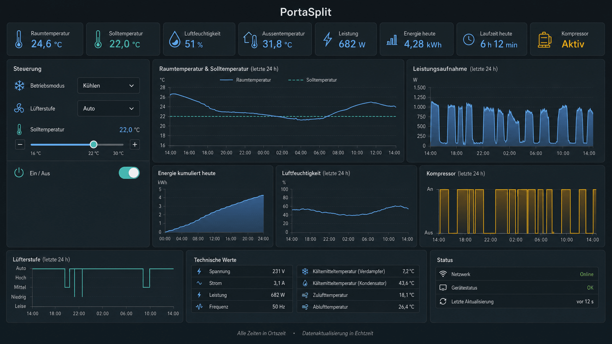

<aside class="article-update">
  <p class="article-update__label">Was PortaSplit-Besitzer jetzt tun sollten</p>
  <p>Über private Cloud-Schnittstellen bezieht Home Assistant bei der Einrichtung den gerätespezifischen Token und Key. Das Projekt Midea AC LAN warnt seit dem 19. Mai 2025 vor möglichen Änderungen. Ein konkreter Abschalttermin des Herstellers ist jedoch nicht dokumentiert. Für Besitzer heisst das:</p>
  <ol>
    <li><strong>Bestehende Einrichtung nicht unnötig auflösen.</strong> Nur die Beschaffung der Zugangswerte braucht die Midea-Cloud. Künftige Änderungen am privaten Endpunkt könnten eine erneute Einrichtung erschweren.</li>
    <li><strong>Token, Key und Konfiguration verschlüsselt sichern.</strong> Falls der Abruf später nicht mehr funktioniert, bleibt das Backup der verlässlichste Weg zur Wiederherstellung.</li>
    <li><strong>Kopplung nicht ohne Not auflösen.</strong> Werkseinstellungen, das Entfernen aus dem Midea-Konto oder ein WLAN-Modul-Tausch erzwingen eine neue Token-Beschaffung, die künftig scheitern kann.</li>
  </ol>
  <p>Bereits eingerichtete Geräte werden lokal gesteuert. Änderungen an der Cloud-Schnittstelle betreffen deshalb zuerst das Hinzufügen und Wiederherstellen, nicht jeden laufenden Schaltbefehl. Die konkreten Schritte stehen im <a href="/blog/midea-portasplit-home-assistant-einrichten">Praxisbeitrag zu Einbindung und Absicherung</a>.</p>
</aside>



Die lokale Steuerung der Midea PortaSplit beruht auf zwei gerätespezifischen Werten: Token und Key. Die Home-Assistant-Integration ruft beide während der Einrichtung über einen privaten Midea-Cloud-Endpunkt ab. Danach sendet sie Steuerbefehle direkt im lokalen Netz.

Das Projekt Midea AC LAN warnt vor möglichen Änderungen an diesen Cloud-Schnittstellen. Neuere Analysen zeigen allerdings, dass daraus keine bestätigte Hersteller-Roadmap oder ein konkreter Abschalttermin abgeleitet werden kann. Dieser Beitrag erklärt das technische Abhängigkeitsverhältnis; die [detaillierte API-Analyse](/blog/midea-v2-cloud-api-portasplit-home-assistant) ordnet die verschiedenen «V2»-Bezeichnungen und den aktuellen Stand ein.

## Die Token-Frage im Detail

### Warum konnte Home Assistant den Token bisher überhaupt bekommen?

Das Interessante ist: Die Community hat den Token nie berechnet. Sie hat vielmehr den Netzwerkverkehr der offiziellen App analysiert und dabei festgestellt, dass die App den Token gar nicht selbst erzeugt, sondern aus der Cloud bezieht:

```text
App
   ↓
Midea Cloud
   ↓
Cloud liefert Token
   ↓
App verwendet Token lokal
```

Die Home-Assistant-Integration hat genau diesen Cloud-Aufruf nachimplementiert. Sie meldet sich mit denselben Endpunkten und demselben Ablauf bei der Cloud an wie die App und erhält so denselben Token und Key. Das eigentliche Fundament ist also nicht eine clevere Berechnung, sondern ein nachgebauter Abruf. Fällt der Endpunkt weg, fällt auch die Beschaffung weg.

### Könnte man den Token aus der offiziellen App auslesen?

Theoretisch ja. Die App muss den Token irgendwann kennen, sonst könnte sie nicht lokal mit dem Gerät sprechen. Grundsätzlich denkbare Wege wären:

- Reverse Engineering der App,
- Mitlesen des Netzwerkverkehrs, falls dieser nicht zusätzlich geschützt ist,
- Instrumentierung der App zur Laufzeit, etwa mit Frida oder Objection,
- Hooking der Funktionen, die den Token verarbeiten.

Genau darauf zielt die Aussage des Entwicklers von Midea AC LAN, dass das bisherige Design aus Sicht von Midea ein Sicherheitsproblem ist: Ein langlebiges Geheimnis, das sich mit vertretbarem Aufwand aus einer breit verteilten App herauslösen lässt, ist schwer zu kontrollieren. Für den einzelnen Nutzer sind diese Wege allerdings aufwändig und ersetzen den bequemen Cloud-Abruf nicht.

### Könnte man den Token direkt vom Gerät erhalten?

Das wäre die eleganteste Lösung. Würde das Gerät beim ersten lokalen Pairing einen öffentlichen Schlüssel austauschen oder über Bluetooth einen einmaligen Pairing-Code verwenden, wäre gar keine Cloud nötig. Viele moderne IoT-Geräte machen genau das.

Midea hat das ursprüngliche LAN-Protokoll jedoch anders entworfen: Das Gerät akzeptiert lokale Befehle erst mit den passenden, cloudbezogenen Zugangsdaten. Es gibt keinen dokumentierten lokalen Pairing-Mechanismus, der den Token ohne Umweg über die Cloud ausgeben würde. Die Cloud ist damit nicht nur Bequemlichkeit, sondern architektonisch der einzige vorgesehene Weg zum Token.

### Könnte die Community Änderungen am Token-Endpunkt umgehen?

Möglich wäre das nur, wenn sich eine der folgenden Optionen findet:

- eine neue Cloud-API, die weiterhin Token liefert,
- eine bislang unbekannte lokale Pairing-Methode,
- eine Schwachstelle im Gerät,
- oder Midea veröffentlicht irgendwann selbst eine offizielle lokale API.

Einfach den Token „nachzurechnen" wird dagegen sehr wahrscheinlich nicht funktionieren. Wäre das möglich, hätte die Community es vermutlich längst umgesetzt und wäre nie auf die Cloud-API angewiesen gewesen. Dass der Umweg über die Cloud überhaupt gebaut wurde, ist das stärkste Indiz dafür, dass es keinen einfacheren lokalen Weg gibt.

## Die Warnung von Midea AC LAN

Das Repository von `Midea AC LAN` enthält eine prominent platzierte „Important Notice". Nach Angaben des Entwicklers hat Midea die serverseitigen Token-APIs in der Meiju- und der SmartHome-Cloud bereits geschlossen. Die Integration greift deshalb derzeit auf Token-Schnittstellen der NetHome-Plus-Cloud zurück, und auch diese sollen schrittweise geschlossen werden. Die Folge wäre, dass bereits eingerichtete Geräte weiterhin lokal funktionieren, neue Geräte aber nicht mehr hinzugefügt werden können. Der Entwickler geht noch weiter und schreibt, Midea wolle langfristig auf eine neue Cloud-Control-API umstellen und damit die bisherige V1-LAN-API unbrauchbar machen.

Die Warnung hat eine kurze Geschichte. Die prominente „Important Notice" kam am 19. Mai 2025 ins README (Pull Request #578) und nannte damals die SmartHome-Cloud als Rückfallebene für das Hinzufügen neuer Geräte. Am 14. Juli 2025 (#639) wurde sie aktualisiert; seither verweist sie auf die NetHome-Plus-Cloud, weil Midea weitere Endpunkte geschlossen hatte. Der Kern blieb über beide Fassungen unverändert: Die Token-Schnittstellen verschwinden nach und nach, nur die jeweils noch nutzbare Cloud wechselt.

Das ist differenziert zu betrachten. Es handelt sich um die Einschätzung eines Open-Source-Projekts, nicht um eine verbindliche Roadmap von Midea, und der Zeitplan ist unbekannt. Ein zukünftiges Firmware-Update kann lokale Funktionen verändern, ein bereits gespeicherter Token kann weiter funktionieren, muss es aber nicht für immer. Eine Werkseinstellung, ein Wechsel des WLAN-Moduls oder ein neues Gerät kann eine erneute Token-Beschaffung erforderlich machen.

Daraus leiten sich die drei Schritte aus der Box am Artikelanfang ab, jeweils mit ihrer Begründung:

- **Eine funktionierende Einrichtung nicht ohne Grund ersetzen.** Die Token-Beschaffung ist der einzige Schritt, der zwingend über die Midea-Cloud läuft. Änderungen am privaten Endpunkt können vor allem eine spätere Neueinrichtung treffen.
- **Zugangsdaten sichern.** Home Assistant speichert Token und Key lokal. Ein defektes System, ein misslungener Restore oder eine versehentlich gelöschte Integration kann die lokale Steuerung dennoch unbrauchbar machen, wenn kein externes Backup vorhanden ist.
- **Kopplung nicht leichtfertig auflösen.** Ob ein Werksreset oder das Entfernen aus dem Midea-Konto bei jedem Modell neue Zugangsdaten erzwingt, ist nicht vollständig dokumentiert. Ein Backup vor solchen Änderungen ist deshalb zwingend.

Der laufende Betrieb ist davon zunächst nicht betroffen: Die lokale Steuerung nutzt die bereits gespeicherten Werte und braucht den Token-Endpunkt nicht mehr. Ein Restrisiko bleibt, falls eine spätere Firmware das lokale Protokoll oder die Authentifizierung ändert. Wie Token, Key und Konfiguration gesichert werden, steht im [Praxisbeitrag zur Einrichtung](/blog/midea-portasplit-home-assistant-einrichten#backup-der-konfiguration).

## Was das für die Sicherheit bedeutet

Die Warnung hat neben der Verfügbarkeit einen sicherheitstechnischen Kern. Laut `Midea AC LAN` basiert die ältere LAN-Architektur auf einer problematischen Annahme: Die Client-Kommunikation galt ursprünglich als ausreichend geschützt, weshalb die von der Cloud ausgegebenen Tokens keine Ablaufzeit erhielten.

Ein nicht ablaufender Token ist für sich genommen noch keine Schwachstelle. Problematisch wird er, wenn er in Protokollen oder ungeschützten Backups landet, an Dritte gelangt oder weder widerrufen noch rotiert werden kann. Der Entwickler von `Midea AC LAN` vermutet, dass Midea auf diese Risiken mit Änderungen an den Token-Diensten und einer stärker cloudbasierten Architektur reagiert. Eine entsprechende Herstellerankündigung mit Zeitplan ist jedoch nicht belegt.

Dabei ist sprachliche Präzision wichtig. Die Community-Integration „hackt" nicht das Klimagerät. Sie implementiert ein proprietäres Protokoll, das durch Reverse Engineering nachvollzogen wurde. Das Sicherheitsproblem entsteht daraus, dass langlebige Geheimnisse ausserhalb der ursprünglich vorgesehenen App verwendet und gespeichert werden können.

Für den Betrieb im eigenen Netz ist vor allem relevant, was Token und Key ermöglichen. Beide authentifizieren die lokale Kommunikation mit dem Gerät. Geraten sie in falsche Hände, könnte ein Angreifer abhängig vom Protokoll und von seiner Netzwerkposition das Gerät erkennen, sich gegenüber dem Gerät authentifizieren, Statusinformationen auslesen, Einstellungen verändern, die Klimaanlage ein- oder ausschalten, Betriebsmodi wechseln und die Solltemperatur verändern. Dazu muss der Angreifer in der Regel trotzdem eine Netzwerkverbindung zum Gerät herstellen können; der Besitz von Token und Key allein ermöglicht keinen Angriff aus dem gesamten Internet. Token und Key sind daher wie ein Passwort zu behandeln. Wie man das Gerät netzwerkseitig so einbettet, dass diese Werte auch bei einer Panne wenig Schaden anrichten, ist das Thema des [zweiten Teils](/blog/midea-portasplit-home-assistant-einrichten#die-portasplit-sicher-betreiben).

## Was davon praktisch bleibt

Die lokale Steuerung der PortaSplit steht und fällt mit Token und Key, die derzeit nur über die Midea-Cloud beschafft werden können. Dieser Umweg ist Teil des Protokolldesigns: Lokale Befehle sind an cloudbezogene Zugangsdaten gebunden. Weil der Endpunkt privat und undokumentiert ist, bleibt die langfristige Verfügbarkeit der inoffiziellen Integration unsicher.

Praktisch heisst das: Zugangsdaten und Konfiguration sichern, eine funktionierende Kopplung nicht unnötig auflösen und Änderungen an Integration und Firmware beobachten. Bereits eingerichtete Geräte laufen lokal weiter. Einrichtung, Backup und Netzwerkschutz beschreibt der [Praxisbeitrag zur PortaSplit](/blog/midea-portasplit-home-assistant-einrichten).

## Quellen

1.  <a class="gh-badge" href="https://github.com/wuwentao/midea_ac_lan" rel="noopener"><span class="gh-badge__label"><svg width="13" height="13" viewBox="0 0 16 16" fill="currentColor" aria-hidden="true"><path d="M8 0C3.58 0 0 3.58 0 8c0 3.54 2.29 6.53 5.47 7.59.4.07.55-.17.55-.38 0-.19-.01-.82-.01-1.49-2.01.37-2.53-.49-2.69-.94-.09-.23-.48-.94-.82-1.13-.28-.15-.68-.52-.01-.53.63-.01 1.08.58 1.23.82.72 1.21 1.87.87 2.33.66.07-.52.28-.87.51-1.07-1.78-.2-3.64-.89-3.64-3.95 0-.87.31-1.59.82-2.15-.08-.2-.36-1.02.08-2.12 0 0 .67-.21 2.2.82.64-.18 1.32-.27 2-.27s1.36.09 2 .27c1.53-1.04 2.2-.82 2.2-.82.44 1.1.16 1.92.08 2.12.51.56.82 1.27.82 2.15 0 3.07-1.87 3.75-3.65 3.95.29.25.54.73.54 1.48 0 1.07-.01 1.93-.01 2.2 0 .21.15.46.55.38A8.01 8.01 0 0 0 16 8c0-4.42-3.58-8-8-8Z"/></svg>GitHub</span><span class="gh-badge__name">wuwentao/midea_ac_lan</span></a>: Integration `Midea AC LAN` mit der „Important Notice" (seit 19. Mai 2025, aktualisiert am 14. Juli 2025), der Begründung über nicht ablaufende Tokens und rekonstruierte Client-Verschlüsselung sowie der Beschreibung des cloudbasierten Token-Bezugs.

2.  <a class="gh-badge" href="https://github.com/mill1000/midea-ac-py" rel="noopener"><span class="gh-badge__label"><svg width="13" height="13" viewBox="0 0 16 16" fill="currentColor" aria-hidden="true"><path d="M8 0C3.58 0 0 3.58 0 8c0 3.54 2.29 6.53 5.47 7.59.4.07.55-.17.55-.38 0-.19-.01-.82-.01-1.49-2.01.37-2.53-.49-2.69-.94-.09-.23-.48-.94-.82-1.13-.28-.15-.68-.52-.01-.53.63-.01 1.08.58 1.23.82.72 1.21 1.87.87 2.33.66.07-.52.28-.87.51-1.07-1.78-.2-3.64-.89-3.64-3.95 0-.87.31-1.59.82-2.15-.08-.2-.36-1.02.08-2.12 0 0 .67-.21 2.2.82.64-.18 1.32-.27 2-.27s1.36.09 2 .27c1.53-1.04 2.2-.82 2.2-.82.44 1.1.16 1.92.08 2.12.51.56.82 1.27.82 2.15 0 3.07-1.87 3.75-3.65 3.95.29.25.54.73.54 1.48 0 1.07-.01 1.93-.01 2.2 0 .21.15.46.55.38A8.01 8.01 0 0 0 16 8c0-4.42-3.58-8-8-8Z"/></svg>GitHub</span><span class="gh-badge__name">mill1000/midea-ac-py</span></a>: Integration `Midea Smart AC`: Beschreibung des cloudbasierten Token- und Key-Bezugs bei V3-Geräten und der lokalen Speicherung der Werte.

3.  [Midea SmartHome](https://www.midea.com/global/smarthome): Herstellerangaben zum SmartHome-Ökosystem und zu den referenzierten Sicherheits- und Datenschutzstandards.
