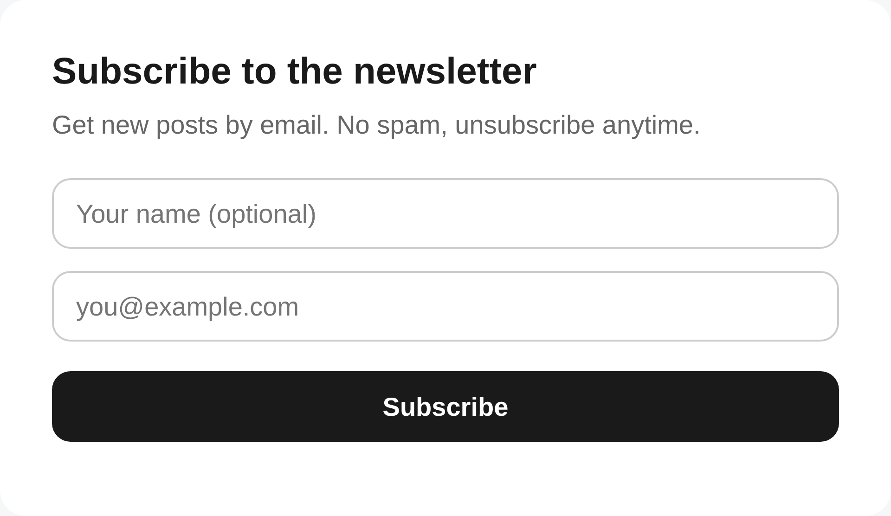

# Serverloser Newsletter: Cloudflare Workers, D1 und ein Deploy-Button

Newsletter-Dienste rechnen nach Abonnentenzahl ab, und die Empfängerliste liegt beim Anbieter. Die klassische Alternative (ein Newsletter-System auf einem eigenen Server) scheitert in der Praxis selten an der Software, sondern am Betrieb: Ein Server will provisioniert, gepatcht, überwacht und bezahlt werden, für ein Werkzeug, das vielleicht einmal pro Woche eine E-Mail verschickt.

Serverless verändert diese Rechnung grundlegend. Ein Newsletter-Backend besteht aus wenigen HTTP-Endpunkten, einer kleinen Datenbank und einem zeitgesteuerten Job: exakt das Profil, für das Cloudflare Workers und D1 gebaut sind. Ich habe das als offenes Template umgesetzt: ein vollständiges Newsletter-System, das per **Deploy-to-Cloudflare-Button** in einem Schritt auf dem eigenen Cloudflare-Konto landet. Ohne Kommandozeile, ohne Serverbetrieb, und dank Warteschlangen-Versand auch für Listen mit tausenden Empfängern innerhalb des Free Tiers. Der Quellcode ist MIT-lizenziert auf [GitHub](https://github.com/pfstr/newsletter-template) verfügbar; der Aufnahme-PR in die offizielle Cloudflare-Template-Galerie läuft.

[](https://deploy.workers.cloudflare.com/?url=https://github.com/pfstr/newsletter-template)



## Was das Template kann

- **Anmeldung**: eine gehostete Anmeldeseite, ein einbettbares Formular für die eigene Website und ein JSON-Endpunkt
- **One-Click-Abmeldung**: konform zu RFC 8058, mit individuellem Token pro Abonnent
- **Compliance eingebaut**: Jede E-Mail erhält automatisch einen Footer mit Abmeldelink und Postadresse; Einwilligungs- und Abmelde-Zeitstempel werden gespeichert (CAN-SPAM/DSGVO)
- **Versand**: eine geschützte Seite, auf der Sie Betreff und HTML einfügen, einen Test an sich selbst schicken und die Kampagne dann einreihen; ein Hintergrundjob liefert in Batches aus, mit Wiederholversuchen
- **Eigene Daten**: Abonnenten liegen in einer D1-Datenbank auf Ihrem Konto und lassen sich jederzeit exportieren
- **Optional, standardmässig aus**: Double-Opt-in, Bot-Schutz per Turnstile und automatischer Versand neuer Blogartikel aus dem RSS-Feed

## Architektur: ein Worker, eine Datenbank

Das gesamte System ist ein einzelner Cloudflare Worker mit zwei Handlern: `fetch` für HTTP (geroutet mit Hono) und `scheduled` für den Cron-Trigger, plus einer D1-Datenbank. Es gibt keinen zweiten Dienst, keinen separaten Queue-Broker, kein eigenes Admin-Backend; selbst die Versand-Warteschlange ist nur eine D1-Tabelle.

| Route | Funktion |
| --- | --- |
| `GET /` | Gehostete Anmeldeseite |
| `GET /embed` | Transparentes Formular zum Einbetten per iframe |
| `POST /api/subscribe` | Anmeldung (CORS-offen für die eigene Website) |
| `GET /confirm` | Bestätigungslink bei Double-Opt-in |
| `GET/POST /unsubscribe` | Abmeldung: Bestätigungsseite per GET, Ausführung per POST (One-Click nach RFC 8058) |
| `GET /admin` | Versandseite (Formular) |
| `POST /api/send` | Kampagne in die Warteschlange stellen, geschützt per Admin-Token |

Das Datenmodell umfasst vier Tabellen: `subscribers` (E-Mail als Primärschlüssel, Name, Status, Abmelde- und Bestätigungs-Token, eine JSON-Spalte für selbst definierte Zusatzfelder sowie Zeitstempel für Bestätigung und Abmeldung), `campaigns` mit Betreff, Inhalt und Zählern je Aussand, `outbox` als Versand-Warteschlange (eine Zeile pro Empfänger) und `sent_posts` für die Deduplizierung des RSS-Versands.

## Deployment ohne Kommandozeile

Der interessanteste Teil ist nicht der Code, sondern der Weg zum laufenden System. Der Deploy-to-Cloudflare-Button liest die Wrangler-Konfiguration des Repositories und erledigt die komplette Einrichtung: Er klont das Repository in den eigenen GitHub-Account, provisioniert die D1-Datenbank, führt die Schema-Migrationen aus und richtet CI ein, sodass jeder Push automatisch deployt. Seit Juli 2025 fragt der Deploy-Flow zusätzlich Umgebungsvariablen und Secrets direkt im Formular ab: im Fall dieses Templates das Admin-Passwort (`ADMIN_TOKEN`), Absendername und -adresse, der Double-Opt-in-Schalter und die Versand-Batch-Grösse (`SEND_BATCH`).

Das Ergebnis nach einem Klick und einem Formular: Die Anmeldeseite ist unter `https://<worker-name>.workers.dev` live und sammelt Abonnenten. Ein Terminal wird an keiner Stelle geöffnet.

## Abonnenten sammeln

Für die Einbindung auf der eigenen Website gibt es drei Wege, aufsteigend nach Integrationstiefe. Der einfachste: den Link zur gehosteten Anmeldeseite teilen. Der praktischste für Site-Builder (WordPress, Webflow, Squarespace, Framer): ein iframe-Einzeiler in einem beliebigen HTML-Embed-Block.

```html
<iframe
  src="https://<worker-name>.workers.dev/embed"
  style="width:100%;max-width:420px;height:90px;border:0"
></iframe>
```

Wer das Formular im eigenen Design haben will, postet direkt an den Endpunkt:

```html
<form
  onsubmit="event.preventDefault();
  fetch('https://<worker-name>.workers.dev/api/subscribe', {
    method:'POST', headers:{'Content-Type':'application/json'},
    body: JSON.stringify({ email: this.email.value })
  }).then(()=>this.reset());"
>
  <input name="email" type="email" placeholder="you@example.com" required />
  <button>Abonnieren</button>
</form>
```

Das Formular erfasst standardmässig E-Mail und optional den Namen. Weitere Felder (Firma, Land, …) definieren Sie in einer einzigen Datei (`src/fields.ts`); sie erscheinen automatisch auf beiden Formularen und landen als JSON in der Datenbank.

## Versand: eigener Provider statt eingebautem Vendor

Beim E-Mail-Versand trifft das Template eine bewusste Entscheidung: Es ist **provider-agnostisch**. Die Datei `src/email.ts` enthält einen einzelnen `sendEmail()`-Adapter mit einem kommentierten Beispiel für eine generische HTTP-API. Welchen Versanddienst Sie dort anbinden, bleibt Ihre Wahl. Kein Anbieter ist fest verdrahtet, keine Registrierung bei einem bestimmten Dienst wird vorausgesetzt. Das Sammeln von Abonnenten funktioniert bereits komplett ohne Versandkonfiguration; der Versand wird freigeschaltet, sobald der Adapter implementiert und das Provider-Secret gesetzt ist. Bietet der Provider zusätzlich einen Batch-Endpunkt (ein API-Aufruf, viele E-Mails), lässt sich in derselben Datei ein optionaler `sendEmailBatch()`-Adapter ergänzen; auch dafür liegt ein kommentiertes Beispiel bereit.

Bedient wird der Versand über die `/admin`-Seite: Betreff und E-Mail-HTML einfügen, Test an die eigene Adresse schicken, dann die Kampagne für alle Abonnenten einreihen. In den E-Mails stehen die Merge-Tags `{{unsubscribe_url}}`, `{{email}}` und `{{name}}` zur Verfügung.

Der eigentliche Versand passiert im Hintergrund, nach dem Transactional-Outbox-Muster: `POST /api/send` schreibt die Kampagne und eine Zeile pro Empfänger in die Datenbank und antwortet sofort. Ein minütlicher Cron-Job liefert anschliessend `SEND_BATCH` E-Mails pro Lauf aus, standardmässig 40: so gewählt, dass jeder Lauf innerhalb der Subrequest-Limits des Workers-Free-Plans bleibt. Die Zeilen werden atomar beansprucht, überlappende Läufe können also nie doppelt senden; fehlgeschlagene Zustellungen werden bis zu dreimal wiederholt, abgestürzte Läufe nach zehn Minuten wieder aufgenommen. Und wer sich abmeldet, während die eigene E-Mail noch in der Warteschlange steht, erhält sie nicht mehr: Der Opt-out storniert auch bereits eingereihte Nachrichten.

## Compliance ist eingebaut, nicht angeflanscht

Wer einen Newsletter versendet, unterliegt Anti-Spam- und Datenschutzrecht: dem US-amerikanischen CAN-SPAM Act, in der EU DSGVO und ePrivacy, in der Schweiz dem UWG. Ein wesentlicher Teil dessen, wofür Newsletter-Dienste bezahlt werden, ist genau diese Pflichterfüllung. Das Template übernimmt den mechanischen Teil davon:

- **Pflicht-Footer**: Jede Kampagnen-E-Mail erhält automatisch einen Footer mit funktionierendem Abmeldelink und der Postadresse des Absenders (`SENDER_ADDRESS`); CAN-SPAM verlangt eine physische Adresse in kommerziellen E-Mails. Die Versandseite warnt, solange die Adresse fehlt.
- **List-Unsubscribe-Header nach RFC 8058** auf jedem Versand: der native Abmelden-Button in Gmail und Outlook, den Gmail und Yahoo von Massenversendern seit 2024 verlangen. Die App baut die Header fertig zusammen; der eigene Provider-Adapter reicht sie nur noch durch.
- **Scanner-sichere Abmeldung**: Der Abmeldelink führt auf eine Bestätigungsseite mit einem einzigen Button. Corporate-Mail-Scanner, die jeden Link einer E-Mail vorab abrufen, können so niemanden versehentlich abmelden; Mailclients nutzen direkt den One-Click-POST.
- **Datenminimierung und Nachweis**: Ein Opt-out wirkt sofort, löscht Name und Zusatzfelder und wird mit Zeitstempel festgehalten, ebenso Anmeldung und Double-Opt-in-Bestätigung. Die Einwilligung lässt sich damit später belegen (DSGVO-Rechenschaftspflicht).
- **Datenschutz-Link**: Mit gesetzter `PRIVACY_URL` erscheint unter dem Anmeldeformular ein Link auf die eigene Datenschutzerklärung.

Beim Betreiber verbleiben wahrheitsgemässe Absender- und Betreffzeilen, der Versand nur an tatsächlich angemeldete Adressen und die Domain-Authentifizierung (SPF/DKIM/DMARC) beim Versanddienst. Rechtsberatung ist das alles nicht.

## Optionen: Double-Opt-in, Turnstile, RSS-Automatik

Drei Funktionen sind eingebaut, aber standardmässig deaktiviert, damit das System ohne Konfiguration lauffähig bleibt:

- **Double-Opt-in** (`DOUBLE_OPT_IN = "true"`): Neue Abonnenten werden als `pending` gespeichert und erst nach Klick auf einen Bestätigungslink aktiv. Für die Schweiz (DSG) und die EU ist dieses Verfahren die sauberere Wahl.
- **Bot-Schutz** mit Cloudflare Turnstile: Site- und Secret-Key als Variablen setzen, mehr nicht; das Widget erscheint automatisch auf beiden Formularen, und der Worker verifiziert jede Anmeldung serverseitig. Ohne gültiges Token wird die Anmeldung abgelehnt.
- **RSS-Auto-Versand**: Ein Cron-Job prüft alle 15 Minuten den eigenen Blog-Feed (RSS 2.0 oder Atom) und reiht neue Artikel automatisch in die Versand-Warteschlange ein. Zwei Sicherungen sind eingebaut: Beim allerersten Lauf wird der bestehende Feed nur als Baseline markiert (das Archiv wird also nicht als E-Mail-Flut verschickt), und jede Artikel-ID wird in `sent_posts` festgehalten, sodass kein Beitrag zweimal rausgeht.

## Grenzen

Das Template ist bewusst minimal gehalten. Der Warteschlangen-Versand liefert im Free Plan standardmässig rund 40 E-Mails pro Minute; eine Kampagne an 1'000 Empfänger dauert damit etwa 25 Minuten, was bei einem Newsletter keine Rolle spielt. Im bezahlten Workers-Plan (10'000 Subrequests pro Aufruf statt 50) lässt sich `SEND_BATCH` in die Hunderte erhöhen; mit einem Batch-Adapter (ein API-Aufruf, bis zu rund 1'000 E-Mails) versendet auch der Free Plan grosse Listen in wenigen Minuten. Die Zustellbarkeit hängt, wie bei jedem System, an der eigenen Absenderdomain: SPF, DKIM und DMARC müssen beim gewählten Versanddienst verifiziert sein, sonst landet der Newsletter im Spam. Und der Single-Opt-in-Default ist der einfachste Start, aber nicht die konservativste Compliance-Variante; dafür gibt es den Schalter.

Zu den Kosten: Workers und D1 haben grosszügige Free-Tier-Kontingente (unter anderem 100'000 Requests pro Tag), die ein Anmeldeformular und wöchentliche Aussände an eine kleine bis mittlere Liste nicht ausschöpfen. Wird ein Limit erreicht, drosselt Cloudflare im Free-Plan, statt eine Rechnung zu stellen.

## Ausprobieren

Der Quellcode inklusive Deploy-Button liegt auf [GitHub](https://github.com/pfstr/newsletter-template); dort steht auch die vollständige Dokumentation der Konfigurationsvariablen.

[](https://github.com/pfstr/newsletter-template)

## Quellen

1.  [pfstr/newsletter-template](https://github.com/pfstr/newsletter-template) — Quellcode des Templates (MIT) mit Deploy-Button und Dokumentation.

2.  [Deploy to Cloudflare buttons](https://developers.cloudflare.com/workers/platform/deploy-buttons/) — automatische Provisionierung von Ressourcen, Repo-Klon und CI beim Deploy.

3.  [Deploy buttons: environment variables and secrets](https://developers.cloudflare.com/changelog/post/2025-07-01-workers-deploy-button-supports-environment-variables-and-secrets/) — Secrets und Variablen werden seit Juli 2025 im Deploy-Formular abgefragt.

4.  [Cloudflare D1](https://developers.cloudflare.com/d1/) — serverloses SQLite, hier für Abonnenten, Sendeprotokoll und RSS-Deduplizierung.

5.  [Cloudflare Turnstile](https://developers.cloudflare.com/turnstile/) — Bot-Schutz ohne Captcha-Rätsel, im Template optional zuschaltbar.

6.  [RFC 8058](https://datatracker.ietf.org/doc/html/rfc8058) — Signaling One-Click Functionality for List Email Headers; Grundlage des nativen Abmelden-Buttons in Gmail und Outlook.

7.  [Workers limits](https://developers.cloudflare.com/workers/platform/limits/) — Subrequest-Limits pro Aufruf (50 im Free Plan, 10'000 im bezahlten Plan); daraus leitet sich die Batch-Grösse des Warteschlangen-Versands ab.

8.  [FTC: CAN-SPAM Act Compliance Guide](https://www.ftc.gov/business-guidance/resources/can-spam-act-compliance-guide-business) — Pflichten für kommerzielle E-Mails, darunter Postadresse und funktionierender Opt-out.
