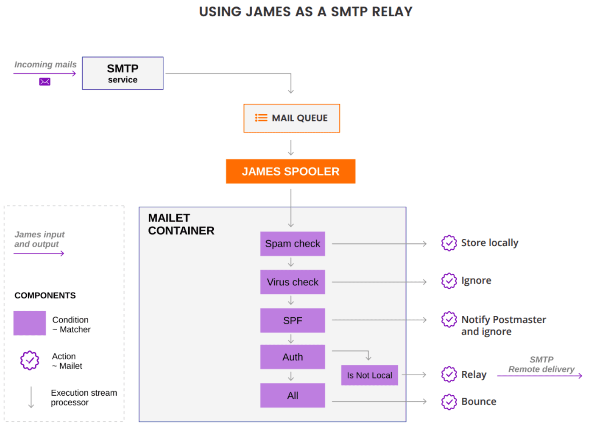
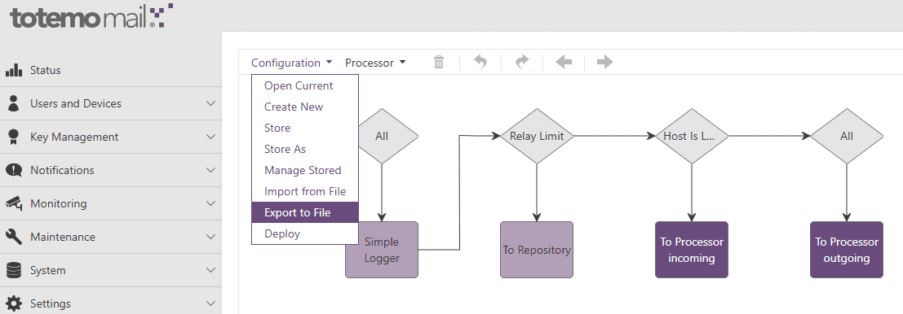

# Mailrouting zwischen Apache James (Totemomail / Kiteworks EPG) und Exchange Online einrichten

In modernen E‑Mail‑Architekturen ist es oft erforderlich, unterschiedliche Mailplattformen miteinander zu verbinden: sei es im Rahmen von Migrationen, hybriden Umgebungen oder zur Integration von MTAs die Spezialaufgaben übernehmen. Dies soll an einem Beispiel einer Mailschlaufe zwischen einem Gateway-System wie TotemoMail (basierend auf Apache James) und einem Cloud‑Dienst wie Exchange Online aufgezeigt werden.

Während Exchange Online primär als Ziel‑ oder Quellsystem für Benutzer-Mailboxen dient, übernimmt TotemoMail die Rolle eines Mail‑Gateways für Verschlüsselung, Signatur, Richtlinienprüfung oder spezielle Routing‑Logik. Damit diese Komponenten sauber zusammenspielen, müssen eingehende und ausgehende Nachrichten kontrolliert zwischen den Systemen weitergeleitet werden, ohne Schleifen, Zustellfehler oder unerwartete Seiteneffekte.

Der Aufbau einer solchen Mailschlaufe ist jedoch alles andere als trivial. Neben klassischen SMTP‑Routingfragen spielen auch interne Mechanismen von Apache James eine entscheidende Rolle.

Sobald die Mailschlaufe steht, ist ein Punkt besonders wichtig: Exchange Online darf Mails ausschliesslich von TotemoMail annehmen, nicht direkt aus dem Internet. Wie sich das mit einem restriktiven Partner-Connector absichern lässt, und was passiert, wenn dieser Schritt fehlt, zeigt [Ghost Sender oder Ghost Admin?](/blog/ghost-sender-exchange-online-nebeneingang).

Gerade dieser interne Verarbeitungsfluss (verborgen hinter XML‑Konfigurationen) ist entscheidend für das korrekte Verhalten einer Mail im System.

Konkret geht es um:

-   wie eine Mailschlaufe zwischen TotemoMail und Exchange Online aufgebaut wird
    
-   wie Apache James intern Mails verarbeitet und weiterleitet
    
-   und worauf man achten muss, um saubere, stabile Mailflows zu gewährleisten
    

Der Fokus liegt dabei nicht nur auf der Konfiguration, sondern auch auf dem Verständnis der zugrunde liegenden Mechanik. Nur wer den Mailfluss wirklich versteht, kann Fehler gezielt analysieren und vermeiden.

### Spoolmanager (Verarbeitung eingehender Mails)

Das XML beschreibt die Konfiguration der Totemomail Mail-Processing-Pipeline (zugrundeliegend ist [Apache James](https://james.apache.org/)). Sie beschreibt, wie E-Mails verarbeitet, verschlüsselt, entschlüsselt, geroutet und zugestellt werden.

Totemomail setzt auf Apache James auf und verwendet dessen Mailet Containers. Das Verarbeitungsmodell des Mailet Containers basiert auf vier zentralen Bausteinen:

-   **Mailets** führen konkrete Aktionen auf E-Mails aus, etwa das Verändern von Inhalten oder Headern, das Auslösen von Aktionen oder das Beenden der Verarbeitung.
    
-   **Matchers** definieren Bedingungen und entscheiden, ob eine E-Mail von einem bestimmten Mailet verarbeitet werden soll.
    
-   **Processors** organisieren diese Matcher- und Mailet-Kombinationen als aufeinanderfolgende Verarbeitungsschritte in einer Pipeline.
    
-   **Mail-Repositories** dienen als Speicherorte für E-Mails während oder nach der Verarbeitung.
    

Durch diese modulare Struktur können Administratoren komplexe Verarbeitungslogiken flexibel zusammenstellen. Bei Totemomail (wie auch bei Apache James im Allgemeinen) sieht die Verarbeitungslogik wie folgt aus:



Bevor eine E-Mail in Apache James verarbeitet werden kann, muss sie zunächst in das interne Mail-Repository gelangen. Dafür ist der SMTP-Server zuständig, der eingehende Verbindungen entgegennimmt und Nachrichten über das SMTP-Protokoll empfängt. In modernen Versionen basiert dieser SMTP-Server auf Netty, einer asynchronen Netzwerk-Engine, die eingehende TCP-Verbindungen verarbeitet. Sobald eine Mail per SMTP vollständig übertragen wurde (insbesondere nach dem DATA-Command), wird sie innerhalb von James in ein internes Objektmodell überführt.

Konkret wird die Nachricht in ein sogenanntes MailImpl-Objekt umgewandelt. Dieses Objekt kapselt nicht nur den eigentlichen Inhalt der E-Mail (als MimeMessage), sondern ergänzt ihn um zusätzliche Metadaten wie Sender, Empfänger, Verarbeitungszustand sowie weitere Attribute, die für das interne Routing und die Verarbeitung erforderlich sind. Ab diesem Zeitpunkt erfolgt die eigentliche Mailverarbeitung über die konfigurierten Prozessoren, Matcher und Mailets.

Bei der Persistierung wird dieses Objekt im FileMailRepository in zwei Teile getrennt:

-   Der MIME-Inhalt wird als roher Byte-Stream im FileStreamStore gespeichert
    
-   Das Java-Objekt (MailImpl) wird per Java Serialization im FileObjectStore abgelegt
    

Dadurch trennt James bewusst Nachrichteninhalt und Verarbeitungszustand. Schauen wir uns nun an, wie das auf dem System implementiert wird.

##### Struktur des /var/mail Repository (die verschiedenen Queues)

Das Queueing findet über verschiedene Ordner (sog. Repositories) statt. Es werden also Mails zwischengespeichert, die später verarbeitet werden. In der Realität geschieht dies natürlich in Sekundenbruchteilen. Wenn jedoch eine Fehlkonfiguration vorliegt, kann es sein, dass sich die Mails in der *spool*\-Queue aufstauen und darauf warten verarbeitet zu werden. Einfach gesagt:

-   Repository = wo ist die Mail gespeichert
    
-   Processor  = wie wird die Mail verarbeitet
    

Hier folgt nun ein Beispielsetup mit verschiedenen Repositories (inklusive solchen, die speziell für eine HIN-Verschlüsselungsgateway-Anbindung verwendet werden). HIN ist sicherer Vertrauensraum für das Schweizer Gesundheitswesen, welcher von der Health Infonet AG vertrieben wird.

> Falls Sie Unterstützung bei der Anbindung von HIN-Mailgateway oder bei der Migration auf die neue HIN-Stargate-Lösung benötigen, finden Sie bei [adeptio](https://adeptio.ch/) die entsprechenden Experten.  
>   
> **adeptio** ist offizieller Partner der [Health Info Net AG](https://www.hin.ch/de/index.cfm) und verfügt als solcher auch über direkte Ansprechpartner beim Hersteller.  
> [➜ Heute noch einen Termin buchen.](https://outlook.office.com/book/Erstgesprchadeptio@adeptio.ch/s/Akxr6wxKAEGw3d5sEmi-AQ2?ismsaljsauthenabled)

```text
Root-Folder:
~/mailer/apps/james/var/mail

├── spool/
│   → Eingehende Mails (initiale Queue, noch nicht verarbeitet)
│
├── incoming/
│   → Mails, die als intern zuzustellen erkannt wurden (Standardfolder)
│
├── incomingHIN/
│   → Eingehende Mails für HIN-Netzwerk (Optional)
│
├── outgoing/
│   → Normale ausgehende Mails (Standardfolder)
│
├── outgoingHIN/
│   → Ausgehende Mails über HIN-Netzwerk (Optional)
│
├── outgoingNotifications/
│   → System- oder Zertifikatsbenachrichtigungen
│
├── error/
│   → Fehlgeschlagene Mails (z. B. Policy, Encryption, Routing)
│
├── DBUnavailable/
│   → Mails, die wegen Backend-/DB-Problemen nicht verarbeitet werden konnten
```

##### Struktur von Mails innerhalb des Totemomail-Filesystems

Wie bereits beschrieben besteht eine Mail innerhalb des Repositorys aus zwei getrennten Dateien:

###### FileStreamStore

\*.FileStreamStore = enthält den MIME-Inhalt der Mails als komplette RFC822/MIME-Mail

Ein cat-Dump zeigt als Inhalt:

```text
From:
To:
Subject:
...
Body
```

Vgl. [RFC 822 - STANDARD FOR THE FORMAT OF ARPA INTERNET TEXT MESSAGES](https://datatracker.ietf.org/doc/html/rfc822)

###### FileObjectStore

\*.FileObjectStore = serialisiertes Java-Objekt (org.apache.james.core.MailImpl) enthält den aktuellen Verarbeitungszustand und Metadaten

Ein cat-Dump zeigt als Inhalt:

```text
attributes: HashMap
errorMessage: String
lastUpdated: Date
message: MimeMessage
name: String
state: String
recipients: Collection
remoteAddr
remoteHost
sender
```

Vgl. [MailImpl (Apache James Server 3.0-beta5-SNAPSHOT API)](https://james.apache.org/server/3/apidocs/org/apache/james/core/MailImpl.html)

### Processor (Welche Rule ziehen nun in welcher Reihenfolge?)

Wir haben oben gelernt, dass die Verarbeitungslogik in Apache James ist vollständig vom Speichermodell entkoppelt ist. Die Verzeichnisstruktur spiegelt dabei ausschliesslich die Queue wider und nicht den aktuellen Verarbeitungs*zustand* der Mail. Der Verarbeitungszustand ist in den Metadaten (\*.FileObjectStore) gespeichert, genauer gesagt im *state*\-Parameter. Gemäss Spezifikation kann hier grundsätzlich ein beliebiger String definiert werden. Dieser korrespondiert mit dem **name**\-Attribut des Processors. In der offiziellen Dokumentation von James steht dazu folgendes:

> [**James Server - James 2.3 - Configuring the SpoolManager**](https://james.apache.org/server/2.3.1/spoolmanager_configuration.html)
> 
> Each processor has a required attribute, **name**. The value of this attribute must be unique for each processor tag. The name of a processor is significant. Certain processors are required (specifically root and error). The name "ghost" is forbidden as a processor name, as it is used to denote a message that should not undergo any further processing.
> 
> The James SpoolManager creates a correspondance between processor names and the "state" of a mail as defined in the Mailet API. Specifically, after each mailet processes a mail, the state of the message is examined. If the state has been changed, the message does not continue in the current processor. If the new state is "ghost" then processing of that message terminates completely. If the new state is anything else, the message is re-routed to the processor with the name matching the new state.
> 
> The root processor is a required processor. All new messages that the SpoolManager finds on the spool are directed to this processor.
> 
> The error processor is another required processor. Under certain circumstances James itself will redirect messages to the error processor. It is also the standard processor to which mailets redirect messages when an error condition is encountered.

Der state somit dabei der Schlüssel zum Aufruf des sogenannten "Processor" innerhalb des Totemomail-Rulesets. Innerhalb des Processors wird dann der nächste State gesetzt. Daraus lässt sich ein wichtiges Architekturprinzip für die Reihenfolge der Verarbeitung von Processors definieren. Totemomail verarbeitet nicht linear im Sinne von Processor1 → Processor2 → Processor3, sondern nach folgendem Prinzip:

1.  state → processor
    
2.  processor → setzt neuen state
    
3.  → nächster processor
    

#### Processor-Struktur im Totemomail-Ruleset (totemomail\_config.xml)

Bevor jegliche Änderungen am System vorgenommen werden, sollte ein Backup des totemomail\_config.xml erstellt werden. Das aktuelle Totemomail-Ruleset kann wie folgt heruntergeladen werden:



Die verschiedenen Prozessoren und darin enthaltene Mailets sind im totemomail\_config.xml ersichtlich. Hier wieder ein Beispiel aus der Praxis:

```xml
<?xml version="1.0" encoding="UTF-8"?>
<spoolmanager>
    <multiparamformat>XML</multiparamformat>

    <processor name="addExtSender">
    <processor name="decrypt">
    <processor name="error">
    <processor name="externalDelivery">
    <processor name="externalDeliveryToHIN">
    <processor name="incoming">
    <processor name="internalDelivery">
    <processor name="internalDeliveryToHIN">
    <processor name="outgoing">
    <processor name="outgoingCheckRecipientCertificate">
    <processor name="outgoingProcessAutoGeneratedMessages">
    <processor name="outgoingProcessEncryptionTriggers">
    <processor name="outgoingProcessEncryptionTriggersRemoval">
    <processor name="outgoingProcessExceptionTriggers">
    <processor name="processIncoming">
    <processor name="processOutgoing">
    <processor name="processOutgoingCertificateExchange">
    <processor name="processOutgoingDomainEncryptionPGP">
    <processor name="processOutgoingDomainEncryptionSMIME">
    <processor name="processOutgoingNotifications">
    <processor name="root">

</spoolmanager>
```

Hier wird gut ersichtlich, dass das Ruleset nicht linear verarbeitet wird. Der *root*\-Processor kann auch ganz am Schluss stehen und wird trotzdem als erstes verarbeitet.

Wenn wir uns nun den *root*\-Processor genauer anschauen, wird ersichtlich, dass man im XML nur sehr wenig der Logik sieht:

```xml
   <processor name="root">
      <mailet class="SimpleLogger" match="All">
         <log-message>totemomail: New Mail</log-message>
         <showSenderEmailAddress>true</showSenderEmailAddress>
         <showRecipientsEmailAddress>true</showRecipientsEmailAddress>
         <showSubject>false</showSubject>
      </mailet>
      <mailet class="ToRepository" match="RelayLimit?Limit=20">
         <repositoryPath>file://var/mail/error</repositoryPath>
         <passThrough>false</passThrough>
         <notifySender>false</notifySender>
         <takeSenderInfoFrom>SMTP</takeSenderInfoFrom>
      </mailet>
      <mailet class="ToProcessor" match="HostIsLocal?includeSubdomains=no">
         <processor>incoming</processor>
      </mailet>
      <mailet class="ToProcessor" match="All">
         <processor>outgoing</processor>
      </mailet>
   </processor>
```

Es handelt sich also nicht um die Implementierung der Logik sondern nur um ein Konfigurationsfile. Die eigentliche Logik befindet sich hier zum Beispiel in der aufgerufenen Klasse *SimpleLogger*. Offenbar scheint die Klasse ein Eigenbau von Totemomail (jetzt Kiteworks) zu sein. Der Code lässt sich somit nicht direkt einsehen und liegt nur als kompilierter Bytecode vor.

Im GUI lässt sich via Rechtsklick auf das entsprechende Mailet jedoch ein Help-Text anzeigen:

> This action gives you the possibility to insert own log messages in the log file. The name and the location of the log file depend on the property totemo.mailer.logFile
> 
> **Parameters:**  
> **log-message (required)**: The text to log.  
> **showSenderEmailAddress (optional)**: Set it to "true" if the log message should contain the senders email address  
> **showRecipientsEmailAddress (optional)**: Set it to "true" if the log message should contain the recipients email addresses  
> **showSubject (optional)**: Set it to "true" if the log message should contain the subject

Zur Logik der Ausführung der einzlnen Matchers und Mailets findet sich folgendes in der Dokumentation von James:

> [James Server - James 2.3 - The SpoolManager, Matchers, and Mailets](https://james.apache.org/server/head/spoolmanager.html)
> 
> Matchers and mailets are used in pairs. At each stage in processing a message is checked against a matcher. The matcher will attempt to match the mail message. The match is not simply a yes or no issue. Instead, the match method returns a collection of matched recipients. If the this collection of matched recipients is empty, the mailet is not invoked. If the collection of matched recipients is the entire set of original recipients, the mail is then processed by the associated mailet. Finally, if the matcher only matches a proper subset of the original recipients, the original mail is duplicated. The recipients for one message are set to the matched recipients, and that message is processed by the mailet. The recipients for the other mail are set to the non-matching recipients, and that message is not processed by the mailet.
> 
> More on matchers and mailets can be found [here](https://james.apache.org/server/head/mailet_api.html).
> 
> One level up from the matchers and mailets are the processors. Each processor is a list of matcher/mailet pairs. **During mail processing, mail messages will be processed by each pair, in order.** In most cases, the message will be processed by all the pairs in the processor. **However, it is possible for a mailet to change the state of the mail message so it is immediately directed to another processor, and no additional processing occurs in the current processor.** Typically this occurs when the mailet wants to prevent future processing of this message (i.e. the mail message has been delivered locally, and hence requires no further processing) or when the mail message has been identified as a candidate for special processing (i.e. the message is spam and thus should be routed to the spam processor). **Because of this redirection, the processors in the SpoolManager form a tree. The root processor, which must be present, is the root of this tree.**
> 
> The SpoolManager continually checks for mail in the spool repository. When mail is first found in the repository, it is delivered to the root processor. Mail can be placed on this spool from a number of sources (SMTP, FetchPOP, a custom component). This spool repository is also used for storage of mail that is being redirected from one processor to another. Mail messages are driven through the processor tree until they reach the end of a processor or are marked completed by a mailet.
> 
> More on configuration of the SpoolManager can be found [here](https://james.apache.org/server/head/spoolmanager_configuration.html).

## Quellen

1.  [Apache James – Projektseite](https://james.apache.org/) — Open-Source-MTA, auf dem totemomail bzw. Kiteworks EPG technisch aufsetzt.
    
2.  [Apache James – «Spool Manager»](https://james.apache.org/server/head/spoolmanager.html) — Verarbeitung eingehender Mails, Spool und Queues.
    
3.  [Apache James – «Spool Manager Configuration»](https://james.apache.org/server/head/spoolmanager_configuration.html) — Processor-Konfiguration und Reihenfolge der Rules.
    
4.  [Apache James – «Mailet API»](https://james.apache.org/server/head/mailet_api.html) — Mailet- und Matcher-Konzept hinter den Rules.
    
5.  [Apache James – «MailImpl» (API-Doc)](https://james.apache.org/server/3/apidocs/org/apache/james/core/MailImpl.html) — Mail-Objektmodell hinter FileStreamStore und FileObjectStore.
    
6.  [IETF – RFC 822](https://datatracker.ietf.org/doc/html/rfc822) — Format von Internet-Textnachrichten (Header und Body).
    
7.  [Microsoft Learn – «Connectors for secure mail flow with a partner»](https://learn.microsoft.com/en-us/exchange/mail-flow-best-practices/use-connectors-to-configure-mail-flow/set-up-connectors-for-secure-mail-flow-with-a-partner) — Connector-Konfiguration für den gesicherten Mailfluss zwischen Exchange Online und dem Gateway.
