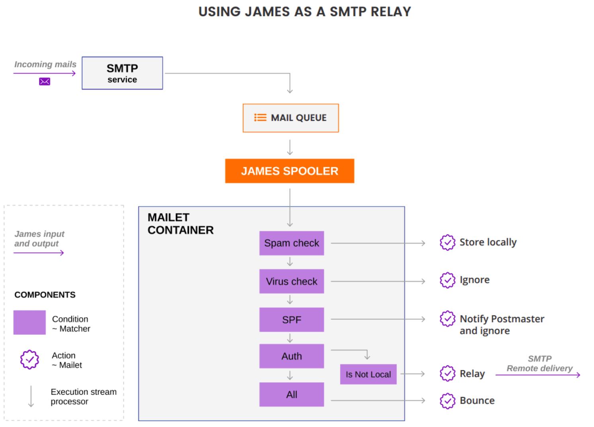
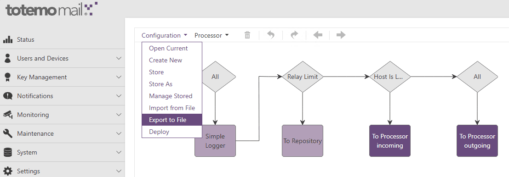

# Mailrouting zwischen totemomail und Exchange Online verstehen

Bei einer Mailschlaufe zwischen Exchange Online und totemomail übernimmt jedes System eine klar abgegrenzte Aufgabe. Exchange Online stellt die Postfächer bereit. Totemomail beziehungsweise das heutige Kiteworks Email Protection Gateway kümmert sich um Verschlüsselung, Signaturen, Richtlinien und besondere Routingregeln.

Damit daraus ein zuverlässiger Mailflow wird, reicht es nicht, zwei SMTP-Connectors einzurichten. Für die Fehlersuche muss auch klar sein, was nach der Annahme einer Nachricht innerhalb des Gateways geschieht: Wo liegt sie? Welche Regel wird als Nächstes ausgeführt? Und weshalb kann eine Nachricht in einer Queue warten, obwohl der SMTP-Dialog bereits erfolgreich abgeschlossen wurde?

Dieser Beitrag erklärt deshalb das Verarbeitungsmodell von [Apache James](https://james.apache.org/), auf dem totemomail aufbaut. Die konkrete Routingkonfiguration hängt von der jeweiligen Umgebung ab; die beschriebenen Processors, Matchers, Mailets und Repositories bilden jedoch das technische Fundament jeder Installation.

Eine wichtige Sicherheitsregel gilt unabhängig von den Details: Wenn totemomail das vorgeschaltete Gateway ist, darf Exchange Online Internet-Mail nur von diesem Gateway annehmen. Dafür braucht es einen restriktiven Partner-Connector. Ein MX-Eintrag allein sperrt den direkten Zustellweg nicht. Der Beitrag [Ein MX-Record ist keine Firewall](/blog/ghost-sender-exchange-online-nebeneingang) zeigt, wie dieser Nebeneingang entsteht und wie er geschlossen wird.

## Vom SMTP-Eingang zur Verarbeitung

Die Verarbeitungslogik von Apache James besteht aus vier Bausteinen:

- **Matchers** prüfen Bedingungen und bestimmen, für welche Empfänger eine Regel gilt.
- **Mailets** führen die eigentliche Aktion aus, etwa Header ändern, verschlüsseln, zustellen oder die weitere Verarbeitung beenden.
- **Processors** fassen Matcher und Mailets zu geordneten Verarbeitungsschritten zusammen.
- **Mail-Repositories** speichern Nachrichten während der Verarbeitung oder nach einem Fehler.

Diese Trennung ist für die Analyse entscheidend: Das Repository beantwortet die Frage, **wo** eine Nachricht liegt. Der Processor bestimmt, **wie** sie weiterverarbeitet wird.



Der SMTP-Server nimmt die Verbindung an und liest die Nachricht bis zum Ende des `DATA`-Abschnitts. Danach erzeugt James ein `MailImpl`-Objekt. Darin stecken der MIME-Inhalt als `MimeMessage` sowie die für die Verarbeitung benötigten Angaben: Absender, Empfänger, Status und weitere Attribute.

Bei einem dateibasierten Repository speichert James diese Informationen getrennt:

- `FileStreamStore` enthält die vollständige RFC-822-/MIME-Nachricht als Byte-Stream.
- `FileObjectStore` enthält das serialisierte `MailImpl`-Objekt mit Status und Metadaten.

Eine Nachricht kann deshalb bereits vollständig angenommen und gespeichert sein, obwohl ihre fachliche Verarbeitung noch aussteht.

## Repositories und Queues unter `/var/mail`

Die einzelnen Repositories erscheinen im Dateisystem als Verzeichnisse. Im Normalbetrieb verweilt eine Nachricht dort nur sehr kurz. Staut sich eine Queue, deutet das meist auf eine fehlerhafte Regel, ein nicht erreichbares Ziel oder einen ausgefallenen Backend-Dienst hin.

Das folgende Beispiel enthält neben den Standard-Queues auch optionale Verzeichnisse für eine HIN-Anbindung. HIN stellt den sicheren Kommunikationsraum für das Schweizer Gesundheitswesen bereit.

> Falls Sie Unterstützung bei der Anbindung von HIN-Mailgateway oder bei der Migration auf die neue HIN-Stargate-Lösung benötigen, finden Sie bei [adeptio](https://adeptio.ch/) die entsprechenden Experten.  
>   
> **adeptio** ist offizieller Partner der [Health Info Net AG](https://www.hin.ch/de/index.cfm) und verfügt als solcher auch über direkte Ansprechpartner beim Hersteller.  
> [➜ Heute noch einen Termin buchen.](https://outlook.office.com/book/Erstgesprchadeptio@adeptio.ch/s/Akxr6wxKAEGw3d5sEmi-AQ2?ismsaljsauthenabled)

```text
Root-Folder:
~/mailer/apps/james/var/mail

├── spool/
│   → Eingehende Mails (initiale Queue, noch nicht verarbeitet)
│
├── incoming/
│   → Mails, die als intern zuzustellen erkannt wurden (Standardfolder)
│
├── incomingHIN/
│   → Eingehende Mails für HIN-Netzwerk (Optional)
│
├── outgoing/
│   → Normale ausgehende Mails (Standardfolder)
│
├── outgoingHIN/
│   → Ausgehende Mails über HIN-Netzwerk (Optional)
│
├── outgoingNotifications/
│   → System- oder Zertifikatsbenachrichtigungen
│
├── error/
│   → Fehlgeschlagene Mails (z. B. Policy, Encryption, Routing)
│
├── DBUnavailable/
│   → Mails, die wegen Backend-/DB-Problemen nicht verarbeitet werden konnten
```

## So liegt eine Nachricht im Dateisystem

Zu jeder gespeicherten Nachricht gehören zwei Dateien.

### `FileStreamStore`: Inhalt der Nachricht

Die Datei `*.FileStreamStore` enthält die vollständige RFC-822-/MIME-Nachricht. Mit `cat` sind Header und Body lesbar:

```text
From:
To:
Subject:
...
Body
```

Das zugrunde liegende Nachrichtenformat ist in [RFC 822](https://datatracker.ietf.org/doc/html/rfc822) beschrieben.

### `FileObjectStore`: Status und Metadaten

Die Datei `*.FileObjectStore` ist ein serialisiertes Java-Objekt vom Typ `org.apache.james.core.MailImpl`. Zu seinen Feldern gehören:

```text
attributes: HashMap
errorMessage: String
lastUpdated: Date
message: MimeMessage
name: String
state: String
recipients: Collection
remoteAddr
remoteHost
sender
```

Die [API-Dokumentation zu `MailImpl`](https://james.apache.org/server/3/apidocs/org/apache/james/core/MailImpl.html) beschreibt das Objektmodell im Detail.

## Der Status wählt den nächsten Processor

Die Verzeichnisstruktur zeigt nur das Repository. Der eigentliche Verarbeitungszustand steht im Feld `state` des `FileObjectStore`. Sein Wert verweist auf das `name`-Attribut eines Processors.

Nach jedem Mailet prüft der SpoolManager diesen Status:

1. Bleibt der Status unverändert, folgt das nächste Matcher-Mailet-Paar im selben Processor.
2. Ändert ein Mailet den Status, beendet James den aktuellen Processor und springt zum gleichnamigen Processor.
3. Der besondere Status `ghost` beendet die Verarbeitung vollständig.

Die zwingend vorhandenen Processors `root` und `error` haben feste Aufgaben. Neue Nachrichten starten in `root`; interne Fehler und entsprechend konfigurierte Mailets leiten nach `error` um. Die Reihenfolge der `<processor>`-Elemente in der XML-Datei bestimmt dagegen **nicht** die Ausführungsreihenfolge.

## Processor-Struktur in `totemomail_config.xml`

Vor jeder Änderung sollte die aktuelle `totemomail_config.xml` exportiert und gesichert werden:



Die verschiedenen Prozessoren und darin enthaltene Mailets sind im totemomail\_config.xml ersichtlich. Hier wieder ein Beispiel aus der Praxis:

```xml
<?xml version="1.0" encoding="UTF-8"?>
<spoolmanager>
    <multiparamformat>XML</multiparamformat>

    <processor name="addExtSender">
    <processor name="decrypt">
    <processor name="error">
    <processor name="externalDelivery">
    <processor name="externalDeliveryToHIN">
    <processor name="incoming">
    <processor name="internalDelivery">
    <processor name="internalDeliveryToHIN">
    <processor name="outgoing">
    <processor name="outgoingCheckRecipientCertificate">
    <processor name="outgoingProcessAutoGeneratedMessages">
    <processor name="outgoingProcessEncryptionTriggers">
    <processor name="outgoingProcessEncryptionTriggersRemoval">
    <processor name="outgoingProcessExceptionTriggers">
    <processor name="processIncoming">
    <processor name="processOutgoing">
    <processor name="processOutgoingCertificateExchange">
    <processor name="processOutgoingDomainEncryptionPGP">
    <processor name="processOutgoingDomainEncryptionSMIME">
    <processor name="processOutgoingNotifications">
    <processor name="root">

</spoolmanager>
```

Obwohl `root` in diesem Auszug am Ende steht, beginnt jede neue Nachricht dort. Entscheidend ist der Name, nicht die Position im Dokument.

Der `root`-Processor selbst enthält eine geordnete Liste von Matcher-Mailet-Paaren:

```xml
   <processor name="root">
      <mailet class="SimpleLogger" match="All">
         <log-message>totemomail: New Mail</log-message>
         <showSenderEmailAddress>true</showSenderEmailAddress>
         <showRecipientsEmailAddress>true</showRecipientsEmailAddress>
         <showSubject>false</showSubject>
      </mailet>
      <mailet class="ToRepository" match="RelayLimit?Limit=20">
         <repositoryPath>file://var/mail/error</repositoryPath>
         <passThrough>false</passThrough>
         <notifySender>false</notifySender>
         <takeSenderInfoFrom>SMTP</takeSenderInfoFrom>
      </mailet>
      <mailet class="ToProcessor" match="HostIsLocal?includeSubdomains=no">
         <processor>incoming</processor>
      </mailet>
      <mailet class="ToProcessor" match="All">
         <processor>outgoing</processor>
      </mailet>
   </processor>
```

Die XML-Datei konfiguriert die Klassen, implementiert sie aber nicht. `SimpleLogger` ist beispielsweise eine von totemomail beziehungsweise Kiteworks bereitgestellte Klasse, deren Quellcode in der Appliance nicht offenliegt. Die Hilfe im Admin-GUI erklärt jedoch ihre Parameter:

- `log-message` legt den Protokolltext fest und ist Pflicht.
- `showSenderEmailAddress` ergänzt auf Wunsch die Absenderadresse.
- `showRecipientsEmailAddress` ergänzt die Empfängeradressen.
- `showSubject` ergänzt den Betreff.

Die Reihenfolge **innerhalb** eines Processors ist verbindlich. Ein Matcher kann keinen, alle oder nur einen Teil der Empfänger auswählen. Bei einer Teilmenge teilt James die Nachricht: Die passenden Empfänger durchlaufen das Mailet, die übrigen werden separat weiterverarbeitet. Ändert ein Mailet danach den Status, springt die Verarbeitung unmittelbar in den genannten Processor; die restlichen Regeln des aktuellen Processors werden übersprungen.

Für die Fehlersuche ergibt sich daraus ein verlässlicher Ablauf:

1. Repository und zugehörige `FileStreamStore`-/`FileObjectStore`-Dateien bestimmen.
2. Im `FileObjectStore` den aktuellen `state` ermitteln.
3. Den gleichnamigen Processor in `totemomail_config.xml` suchen.
4. Matchers und Mailets in ihrer tatsächlichen Reihenfolge prüfen.
5. Bei einem Statuswechsel im Ziel-Processor fortfahren.

So lässt sich ein Mailflow schrittweise verfolgen, ohne die XML-Datei fälschlich von oben nach unten als lineares Programm zu lesen.

## Quellen

1.  [Apache James – Projektseite](https://james.apache.org/): Open-Source-MTA, auf dem totemomail bzw. Kiteworks EPG technisch aufsetzt.
    
2.  [Apache James – «Spool Manager»](https://james.apache.org/server/head/spoolmanager.html): Verarbeitung eingehender Mails, Spool und Queues.
    
3.  [Apache James – «Spool Manager Configuration»](https://james.apache.org/server/head/spoolmanager_configuration.html): Processor-Konfiguration und Reihenfolge der Rules.
    
4.  [Apache James – «Mailet API»](https://james.apache.org/server/head/mailet_api.html): Mailet- und Matcher-Konzept hinter den Rules.
    
5.  [Apache James – «MailImpl» (API-Doc)](https://james.apache.org/server/3/apidocs/org/apache/james/core/MailImpl.html): Mail-Objektmodell hinter FileStreamStore und FileObjectStore.
    
6.  [IETF – RFC 822](https://datatracker.ietf.org/doc/html/rfc822): Format von Internet-Textnachrichten (Header und Body).
    
7.  [Microsoft Learn – «Connectors for secure mail flow with a partner»](https://learn.microsoft.com/en-us/exchange/mail-flow-best-practices/use-connectors-to-configure-mail-flow/set-up-connectors-for-secure-mail-flow-with-a-partner): Connector-Konfiguration für den gesicherten Mailfluss zwischen Exchange Online und dem Gateway.
