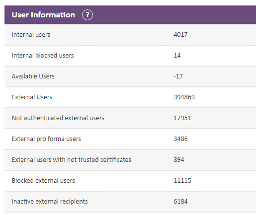
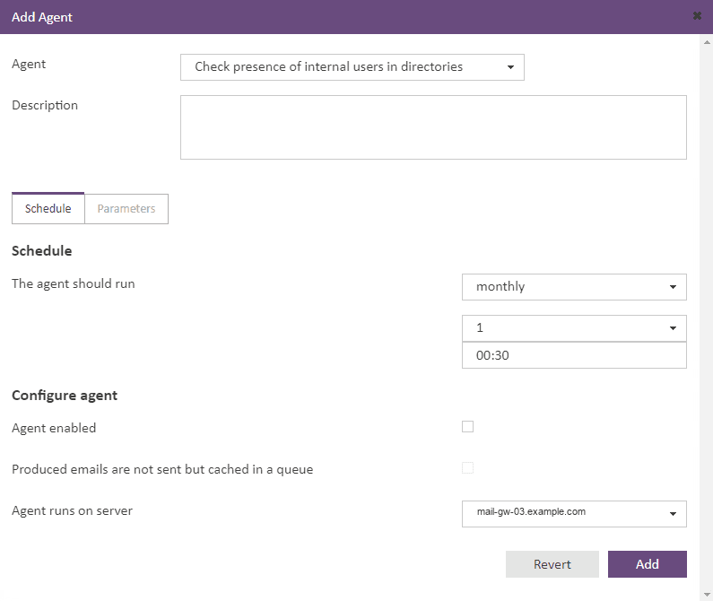
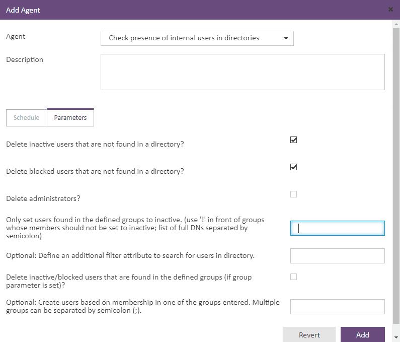

# Totemomail: "The licensed user limit has been reached" (interne User per LDAP automatisch aufräumen)

Wenn Sie eine totemomail-Umgebung über mehrere Jahre betreiben, werden Sie irgendwann auf die Meldung *„The licensed user limit has been reached."* stossen. Das System arbeitet weiter, befindet sich aber in einer Unterlizenzierung. Die Ursache liegt fast immer im fehlenden Offboarding interner Benutzer.

Die Hostnamen, DNs und Service-Accounts in diesem Artikel sind generische Beispiele (`example.com`). Passen Sie sie an Ihre Umgebung an.

## Lizenzmodell

totemomail unterscheidet zwei Klassen von Benutzern, von denen nur eine lizenzrelevant ist.

| Benutzertyp | Beschreibung | Lizenzrelevant |
| --- | --- | --- |
| Internal Users | Benutzer der eigenen Organisation, die verschlüsselt senden und empfangen | Ja |
| External Users | Externe Kommunikationspartner (WebMail, PDF, S/MIME, PGP) | Nein |


Ein interner Benutzer wird angelegt, sobald er das erste Mal über das Gateway kommuniziert. Das passiert automatisch. Das Entfernen dagegen nicht: Verlässt ein Mitarbeiter die Organisation, deaktivieren Sie üblicherweise das AD-Konto. Der totemomail-Eintrag bleibt aber bestehen. Über die Jahre sammeln sich so verwaiste Konten an, die weiter Lizenzen belegen.

### Statusanzeige

Den aktuellen Stand finden Sie unter **Settings → Overview → User Information**.



*Available Users steht auf* `*-17*`*. Den 4017 internen Benutzern steht eine geringere Zahl lizenzierter Plätze gegenüber.*

Die wichtigen Zeilen:

-   **Internal users** (`4017`): angelegte interne Benutzer
    
-   **Internal blocked users** (`14`): gesperrt, aber weiterhin lizenzrelevant
    
-   **Available Users** (`-17`): verfügbare Lizenzen; ein negativer Wert bedeutet Unterlizenzierung
    

Sobald *Available Users* unter Null fällt, sehen Sie die Warnung an der Glocke:


*„The licensed user limit has been reached." Der Mailfluss läuft weiter, die Meldung bleibt aber dauerhaft sichtbar.*

Wichtig: Die Unterlizenzierung blockiert den Mailfluss nicht. Es ist ein lizenzrechtlicher, kein technischer Zustand. Sie haben also Zeit für eine saubere Lösung, sollten den Zustand aber nicht dauerhaft ignorieren.

## Lösungsansätze

### Manuelles Löschen

Sie können interne Benutzer unter **Internal Users** einzeln suchen und löschen. Das behebt den akuten Zustand, das Problem kommt aber nach einigen Monaten zurück. Bei mehreren tausend Konten werden Sie damit nicht glücklich.

### LDAP-Anbindung mit Cleanup-Agent

Der tragfähige Weg ist die Anbindung an das Active Directory per LDAP. Ein Agent gleicht die internen Benutzer regelmässig gegen das Verzeichnis ab und entfernt oder deaktiviert Konten, die im AD nicht mehr existieren. Damit wird das AD zur führenden Quelle, und Ihr Offboarding-Prozess im AD erledigt die Lizenzhygiene gleich mit.

## LDAP-Grundlagen

| Begriff | Bedeutung |
| --- | --- |
| DN (Distinguished Name) | Eindeutiger Pfad zu einem Objekt, z. B. `CN=John Doe,OU=Users,DC=corp,DC=example,DC=com` |
| Base DN / Search Base | Wurzel der Suche, z. B. `DC=corp,DC=example,DC=com` |
| Bind DN | Konto, mit dem sich totemomail am AD authentifiziert |
| Filter | LDAP-Suchausdruck, z. B. `(&(objectClass=user)(sAMAccountName=jdoe))` |


### Ports

| Port | Protokoll | Verwendung |
| --- | --- | --- |
| 389 | LDAP | unverschlüsselt / STARTTLS |
| 636 | LDAPS | LDAP über TLS |
| 3268 | Global Catalog | forestweite Suche, unverschlüsselt |
| 3269 | Global Catalog SSL | forestweite Suche über TLS |


In einer Single-Domain-Umgebung kommen Sie mit Port 636 gegen einen Domain Controller aus. Betreiben Sie einen Forest mit mehreren Domains, liefert Ihnen nur der Global Catalog (Port 3269) forestweite Ergebnisse. Ein DC auf Port 636 kennt ausschliesslich die Objekte seiner eigenen Domäne und beantwortet Suchen ausserhalb seiner Partition mit einem Referral (ein Detail, das in Multi-Domain-Umgebungen gern übersehen wird).

### userAccountControl

Ob ein AD-Konto deaktiviert ist, steht im Bit-Feld `userAccountControl`. Das Flag `ACCOUNTDISABLE` hat den Wert `2`. Über die LDAP-Matching-Rule `1.2.840.113556.1.4.803` (`LDAP_MATCHING_RULE_BIT_AND`) werten Sie einzelne Bits aus:

```text
# Aktive Benutzer
(&(objectClass=user)(!(userAccountControl:1.2.840.113556.1.4.803:=2)))

# Deaktivierte Benutzer
(&(objectClass=user)(userAccountControl:1.2.840.113556.1.4.803:=2))
```

## Schritt 1: Service-Account im AD

Für die Anbindung legen Sie ein dediziertes Konto mit reinen Leserechten an. Nehmen Sie dafür kein Administratorkonto. Der Bind-Benutzer muss das AD nur lesen können.

```powershell
New-ADUser -Name "svc-totemomail-ldap" `
  -SamAccountName "svc-totemomail-ldap" `
  -UserPrincipalName "svc-totemomail-ldap@corp.example.com" `
  -Path "OU=Service Accounts,DC=corp,DC=example,DC=com" `
  -AccountPassword (Read-Host -AsSecureString "Passwort") `
  -PasswordNeverExpires $true `
  -Enabled $true
```

Ein gewöhnlicher Domänenbenutzer kann das AD bereits lesen, zusätzliche Rechte braucht der Account also nicht. Für das Passwort empfiehlt sich ein langer, zufälliger Wert, den Sie in Ihrem Passwort-Tresor ablegen.

Wenn Ihre Sicherheitsrichtlinie es vorsieht, können Sie auch ein gMSA (Group Managed Service Account) verwenden. totemomail erwartet allerdings Bind-DN und Passwort, weshalb in der Praxis meist ein klassischer Service-Account mit `PasswordNeverExpires` zum Einsatz kommt.

## Schritt 2: LDAP-Verbindung auf der Kommandozeile prüfen

Bevor Sie etwas in totemomail konfigurieren, sollten Sie die LDAP-Verbindung auf der Kommandozeile verifizieren. Das ist der Schritt, den die meisten überspringen. Funktioniert `ldapsearch`, funktioniert auch die Anbindung in totemomail. Schlägt der Test fehl, wissen Sie wenigstens, an welcher Stelle es klemmt, statt im totemomail-GUI zu raten.

### 2.1 Portprüfung

Unter Linux, etwa von der totemomail-Appliance aus:

```bash
nc -vz dc01.corp.example.com 636
nmap -p 389,636,3268,3269 dc01.corp.example.com
```

Unter Windows mit PowerShell:

```powershell
Test-NetConnection -ComputerName dc01.corp.example.com -Port 636
```

Kommt hier keine Verbindung zustande, haben Sie ein Firewall- oder Routing-Problem und kein LDAP-Problem.

### 2.2 TLS-Zertifikat prüfen

In der Praxis scheitert LDAPS am häufigsten am Zertifikat. Sehen Sie sich deshalb an, was der DC ausliefert:

```bash
openssl s_client -connect dc01.corp.example.com:636 -showcerts </dev/null
```

Achten Sie auf zwei Dinge:

-   `**subject=**` **/** `**issuer=**`: Der Hostname im Zertifikat (CN bzw. SAN) muss zu dem Hostnamen passen, über den Sie sich verbinden. Verbinden Sie sich über die IP-Adresse, schlägt die Prüfung fehl, wenn das Zertifikat nur den FQDN enthält.
    
-   `**Verify return code: 0 (ok)**`: Die ausstellende CA muss totemomail bekannt sein. Bei einer internen Enterprise-CA müssen Sie deren Root- bzw. Issuing-Zertifikat in den Truststore von totemomail importieren.
    

### 2.3 Bind und Suche mit ldapsearch

`ldapsearch` gehört zu `ldap-utils` (Debian/Ubuntu) bzw. `openldap-clients` (RHEL):

```bash
ldapsearch -x \
  -H ldaps://dc01.corp.example.com:636 \
  -D "CN=svc-totemomail-ldap,OU=Service Accounts,DC=corp,DC=example,DC=com" \
  -W \
  -b "DC=corp,DC=example,DC=com" \
  "(&(objectClass=user)(sAMAccountName=jdoe))" \
  dn sAMAccountName mail userAccountControl
```

| Flag | Bedeutung |
| --- | --- |
| `-x` | Simple Authentication (Bind-DN und Passwort) |
| `-H` | LDAP-URI inklusive Schema (`ldaps://`) und Port |
| `-D` | Bind-DN |
| `-W` | Passwort interaktiv abfragen |
| `-b` | Search Base |
| danach | Filter, anschliessend die zurückzugebenden Attribute |


Liefert die Abfrage das Objekt mit seinen Attributen zurück, steht die Verbindung. Wie viele Konten im AD deaktiviert sind, ermitteln Sie über den Bit-Filter:

```bash
ldapsearch -x -H ldaps://dc01.corp.example.com:636 \
  -D "CN=svc-totemomail-ldap,OU=Service Accounts,DC=corp,DC=example,DC=com" -W \
  -b "DC=corp,DC=example,DC=com" \
  "(&(objectClass=user)(userAccountControl:1.2.840.113556.1.4.803:=2))" \
  sAMAccountName | grep -c sAMAccountName
```

### 2.4 Werkzeuge unter Windows

`**ldp.exe**` ist das grafische LDAP-Werkzeug von Microsoft, das auf jedem DC vorhanden und Teil der RSAT ist. Sie verbinden sich über `Connection → Connect` (Host, Port 636, SSL aktivieren), authentifizieren sich mit `Connection → Bind` und navigieren über `View → Tree` mit dem Base DN durch den Verzeichnisbaum.

Ohne RSAT kommen Sie in PowerShell über den ADSI-Searcher ans Ziel:

```powershell
$searcher = [adsisearcher]"(&(objectClass=user)(sAMAccountName=jdoe))"
$searcher.SearchRoot = [adsi]"LDAP://dc01.corp.example.com/DC=corp,DC=example,DC=com"
$searcher.FindOne().Properties
```

Mit RSAT und dem AD-Modul geht es kürzer:

```powershell
Get-ADUser -Server dc01.corp.example.com `
  -SearchBase "DC=corp,DC=example,DC=com" `
  -Filter "Enabled -eq '$true'" |
  Measure-Object
```

Klassisch über `dsquery`, auf jedem DC verfügbar:

```bash
dsquery user -disabled -limit 0
```

Erst wenn einer dieser Tests sauber durchläuft, gehen Sie in totemomail weiter.

## Schritt 3: LDAP-Verbindung in totemomail konfigurieren

Das LDAP-Directory legen Sie im Admin-GUI unter **Directories / LDAP** an. Übernehmen Sie dabei genau die Werte, die Sie zuvor getestet haben:

| Feld | Beispielwert |
| --- | --- |
| Host / URL | `ldaps://dc01.corp.example.com:636` |
| Bind DN | `CN=svc-totemomail-ldap,OU=Service Accounts,DC=corp,DC=example,DC=com` |
| Bind Password | Passwort des Service-Accounts |
| Base DN | `DC=corp,DC=example,DC=com` |
| User Filter | `(&(objectClass=user)(objectCategory=person))` |
| Login Attribute | `sAMAccountName` (alternativ `mail` oder `userPrincipalName`) |


Setzen Sie LDAPS gegen eine interne CA ein, müssen Sie deren Root- bzw. Issuing-Zertifikat in den Truststore von totemomail importieren. Sonst scheitert der TLS-Handshake mit „certificate verify failed", auch wenn `ldapsearch` mit `-x` vorher funktioniert hat: `ldapsearch` prüft das Zertifikat in dieser Form nämlich nicht strikt.

Nach dem Speichern lösen Sie die eingebaute Test-Verbindung aus. Sie bestätigt den Bind.

## Schritt 4: Cleanup-Agent anlegen

Unter **Maintenance → Agents → Add** legen Sie einen Agent vom Typ **„Check presence of internal users in directories"** an.

### 4.1 Reiter „Schedule"



*Der Agent läuft hier monatlich am 1. um 00:30 Uhr. Über „Agent runs on server" legen Sie den ausführenden Knoten im Cluster fest.*

| Feld | Empfehlung | Begründung |
| --- | --- | --- |
| The agent should run | `monthly`, Tag `1`, `00:30` | ausserhalb der Geschäftszeiten; monatlich genügt für die Lizenzhygiene |
| Agent enabled | erst nach dem Testlauf aktivieren | siehe Schritt 5 |
| Produced emails are not sent but cached in a queue | für den ersten Lauf aktivieren | Testlauf ohne Mailversand |
| Agent runs on server | ein Knoten des Clusters | der Job soll nur auf einem Knoten laufen |


### 4.2 Reiter „Parameters"



*Die Parameter steuern, welche internen Benutzer gelöscht, deaktiviert oder neu angelegt werden.*

| Parameter | Empfehlung | Wirkung |
| --- | --- | --- |
| Delete inactive users that are not found in a directory? | aktivieren | Inaktive interne Benutzer ohne AD-Eintrag werden gelöscht. Das ist der Kern der Lizenzbereinigung. |
| Delete blocked users that are not found in a directory? | aktivieren | Gesperrte interne Benutzer ohne AD-Eintrag werden ebenfalls gelöscht |
| Delete administrators? | leer lassen | Administratorkonten sollen nicht automatisch gelöscht werden |
| Only set users found in the defined groups to inactive | optional | Benutzer werden auf inaktiv gesetzt statt gelöscht. Ein vorangestelltes `!` nimmt die Mitglieder der angegebenen Gruppe aus. DNs trennen Sie mit `;`. |
| Additional filter attribute | optional | zusätzliches Attribut für die Suche im Verzeichnis, z. B. `proxyAddresses` |
| Delete inactive/blocked users that are found in the defined groups | leer lassen | greift nur bei gesetztem Gruppenparameter |
| Create users based on group membership | optional | legt neue interne Benutzer anhand der AD-Gruppenmitgliedschaft an. Mehrere Gruppen trennen Sie mit `;`. |


Die Negation im Feld *„Only set users found in the defined groups to inactive"* funktioniert über ein `!` vor einem Gruppen-DN. Die Mitglieder dieser Gruppe werden von der Aktion ausgenommen:

```text
CN=Mitarbeiter,OU=Groups,DC=corp,DC=example,DC=com;!CN=Dienstkonten,OU=Groups,DC=corp,DC=example,DC=com
```

In diesem Beispiel setzen Sie Benutzer der Gruppe *Mitarbeiter* bei Abwesenheit im AD auf inaktiv, während Mitglieder der Gruppe *Dienstkonten* unangetastet bleiben.

## Schritt 5: Testlauf und Validierung

Lassen Sie den Agent nicht ohne Testlauf gegen den Produktivbestand laufen. Gehen Sie stattdessen in dieser Reihenfolge vor:

1.  **Queue-Modus aktivieren**: über die Option *„Produced emails are not sent but cached in a queue"*. Der Agent ermittelt die geplanten Aktionen, ohne Mails zu versenden.
    
2.  **Manuell ausführen** und das Agent-Log auswerten: Wie viele Benutzer wären betroffen, und stehen unerwartete Konten wie Funktionspostfächer in der Liste?
    
3.  **Plausibilität gegen** `**ldapsearch**`: Die Zahl der nicht im AD gefundenen Benutzer sollte zu Ihrer manuellen LDAP-Abfrage passen.
    
4.  Stimmt das Ergebnis, deaktivieren Sie den Queue-Modus, setzen *Agent enabled* und schalten den Schedule scharf.
    
5.  Nach dem ersten produktiven Lauf prüfen Sie **Settings → Overview → User Information** erneut. *Available Users* sollte dann wieder im positiven Bereich liegen.
    

## Troubleshooting

| Symptom | Ursache | Massnahme |
| --- | --- | --- |
| `Can't contact LDAP server` | Port 636 nicht erreichbar / falscher Host | mit `Test-NetConnection` bzw. `nc -vz` prüfen, Firewall kontrollieren |
| `Invalid credentials (49)` | Bind-DN oder Passwort falsch | Bind-DN als vollständigen DN angeben, nicht als `user@domain` |
| `certificate verify failed` | CA dem Truststore unbekannt | Root- bzw. Issuing-CA importieren |
| Hostname-Mismatch im TLS | Verbindung über IP statt FQDN | CN/SAN des Zertifikats als Host verwenden |
| `Referral (10)` | Suche überschreitet die Domänengrenze | Global Catalog auf Port 3269 statt DC auf 636 verwenden |
| Deaktivierte Benutzer werden nicht erkannt | fehlender `userAccountControl`\-Filter | Bit-Matching-Rule `:1.2.840.113556.1.4.803:=2` verwenden |
| Agent löscht zu viele Konten | Filter zu weit / Base DN falsch | im Queue-Modus testen, Base DN einschränken |


Mit dem Flag `-d 1` liefert `ldapsearch` den Debug-Output des Verbindungsaufbaus:

```bash
ldapsearch -d 1 -x -H ldaps://dc01.corp.example.com:636 ...
```

So sehen Sie, ob der TLS-Handshake oder erst der Bind fehlschlägt. Diese Unterscheidung zeigt Ihnen das totemomail-GUI unter seiner generischen Fehlermeldung nicht.

## Sicherheit

-   **Read-only Service-Account.** Der Bind-Benutzer braucht ausschliesslich Leserechte.
    
-   **LDAPS statt LDAP.** Verwenden Sie Port 636 bzw. 3269. LDAP auf Port 389 überträgt das Bind-Passwort im Klartext. Active Directory erzwingt mit LDAP Channel Binding und Signing ohnehin zunehmend abgesicherte Verbindungen.
    
-   **Passwort-Rotation.** `PasswordNeverExpires` ist betrieblich praktikabel. Dokumentieren Sie den Account und rotieren Sie das Passwort nach Plan.
    
-   **Monitoring.** Überwachen Sie *Available Users* (idealerweise per Alerting), statt auf die Glockenwarnung zu warten.
    
-   **Erster Lauf im Queue-Modus.** Ein fehlerhafter Filter kann eine grosse Zahl von Konten treffen.
    

## Fazit

Das Erreichen des Lizenzlimits ist kein technischer Defekt, sondern die Folge eines fehlenden Offboarding-Prozesses. Die nachhaltige Lösung ist der regelmässige Abgleich gegen das Active Directory als führende Quelle. Entscheidend ist die Reihenfolge:

1.  LDAP-Verbindung auf der Kommandozeile verifizieren (`ldapsearch`, `openssl s_client`, `Test-NetConnection`)
    
2.  Verbindung in totemomail konfigurieren
    
3.  Agent im Queue-Modus validieren
    
4.  Agent produktiv schalten
    

Wer diese Reihenfolge einhält, löst das akute Lizenzproblem und verhindert, dass es wiederkommt.

## Quellen

1.  [totemo / Kiteworks – totemomail (Email Protection Gateway)](https://totemo.com/en/resources/downloads) — Produktdokumentation zu totemomail (Lizenzmodell, LDAP-Anbindung, Cleanup-Agent); die Technologie wird bei Kiteworks als Email Protection Gateway weitergeführt.
    
2.  [Microsoft Learn – «UserAccountControl property flags»](https://learn.microsoft.com/en-us/troubleshoot/windows-server/active-directory/useraccountcontrol-manipulate-account-properties) — Bedeutung der Flags, u. a. `ACCOUNTDISABLE` (0x0002) und `NORMAL_ACCOUNT`.
    
3.  [Microsoft Learn – «Search Filter Syntax»](https://learn.microsoft.com/en-us/windows/win32/adsi/search-filter-syntax) — Bitweiser LDAP-Filter über die Matching-Rule-OID `1.2.840.113556.1.4.803` (LDAP\_MATCHING\_RULE\_BIT\_AND).
    
4.  [OpenLDAP – «ldapsearch» (Manpage)](https://www.openldap.org/software/man.cgi?query=ldapsearch) — Aufrufoptionen (`-x`, `-H ldaps://`, `-D`, `-W`, `-b`) für Bind und Suche.
    
5.  [Microsoft Learn – «Service overview and network port requirements»](https://learn.microsoft.com/en-us/troubleshoot/windows-server/networking/service-overview-and-network-port-requirements) — LDAP-Ports 389/636 sowie Global-Catalog-Ports 3268/3269.
